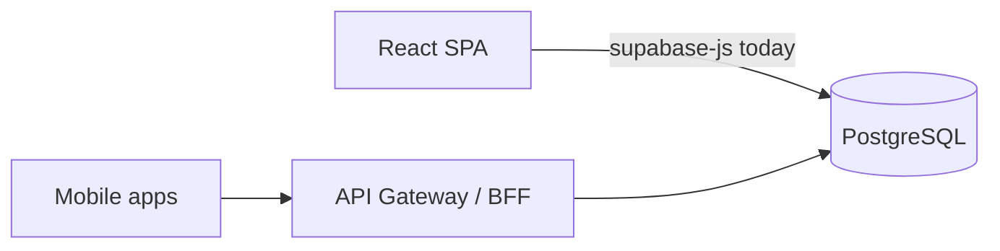

# Architecture

## System boundaries

| Layer | Responsibility | Technology |
|-------|----------------|------------|
| **Presentation** | UI, forms, charts, realtime subscriptions | React 18 + Vite, Tailwind, Radix |
| **Client SDK** | Auth session, HTTP to Supabase | `@supabase/supabase-js` |
| **API (implicit)** | REST over tables/views/RPCs | PostgREST (Supabase) |
| **Privileged API** | Admin user ops, release automation, partner stock API | Supabase Edge Functions (Deno) |
| **Data** | Business entities, RLS, triggers | PostgreSQL |
| **Files** | Designs, invoices, media | Supabase Storage |
| **Realtime** | Chat, notifications, live updates | Supabase Realtime |
| **Static hosting** | Built SPA assets | Netlify CDN |

There is **no application server** in-repo between the browser and Supabase (except Edge Functions for admin).

## Dependency direction

```text
Netlify (static) ── serves ──> React SPA
React SPA ──depends on──> supabase-js ──> Supabase Cloud
Edge Functions ──depends on──> Supabase service APIs + GitHub (promote)
Migrations ──apply to──> PostgreSQL (via CLI / GitHub Actions)
```

Frontend must **not** depend on Edge Functions for core CRUD (only admin/promote).

## Communication patterns

| Pattern | Used for | Example |
|---------|----------|---------|
| **Direct table access** | CRUD on orders, profiles | `supabase.from('orders').select()` |
| **RPC** | Multi-step or security-definer logic | `get_or_create_direct_conversation` |
| **Storage upload** | Binary assets | `supabase.storage.from('...').upload()` |
| **Realtime subscribe** | Live chat, notifications, dashboard data sync | `subscribePostgresChanges()` in `src/realtimeUtils.js` |

## Dashboard realtime (2026-07-09)

Cross-user updates propagate without manual refresh:

1. **Publication** — `supabase_realtime` includes orders, inventory, dispatch, goals, masters, profiles, contacts, dealers, printing dept (see `DATABASE.md` migrations).
2. **Helper** — `subscribePostgresChanges({ channelName, tables, onEvent })` debounces burst events (400ms).
3. **App shell** — `orders-live`, masters, profiles, admin permissions, global search extras.
4. **Feature panels** — each major tab subscribes to its tables and silent-refetches (dispatch, goals, inventory, etc.).
5. **Fallback** — orders poll every 120s when tab visible if Realtime disconnects.

Notifications (bell/toasts) remain separate INSERT subscriptions; they alert users but do not replace source-panel refetch.

| **Edge Function invoke** | Admin-only | `supabase.functions.invoke('admin-create-user')` |
| **Partner HTTP API** | Scott International stock sync | `dashboard-stock-api` (Bearer API key, service role DB) |

## Dashboard Stock API (2026-07-10)

External Scott backend calls Edge Function `dashboard-stock-api` (not browser):

1. **Auth** — static Bearer `DASHBOARD_API_KEY` (no Supabase JWT).
2. **Data** — `inventory_facility_stock` (on_hand / reserved per facility + SKU), reservations, adjustments.
3. **Webhooks** — mutations enqueue `dashboard_webhook_outbox`; edge function POSTs HMAC-signed payloads to Scott server when secrets set.
4. **RLS** — API tables have RLS enabled with **no** anon/authenticated policies; only `service_role` (edge function) can access.

See [DASHBOARD_STOCK_API.md](./DASHBOARD_STOCK_API.md) and migration `20260710120000_dashboard_stock_api.sql`.

## Module map (frontend)

| Module | Path | Depends on |
|--------|------|------------|
| Shell / routing | `App.jsx` | Most feature panels |
| Support desk | `EnquiryPanel.jsx`, `SupportTicketDesk.jsx`, `enquiryConciergeUtils.js`, `SupportDelayAlertCard.jsx`, `SupportProductionStatusCard.jsx` | Enquiry + Complaints desks; Delay alert and Order status tabs after Complaints; Report blank |
| Inventory | `src/inventory/*` | `inventoryDbUtils`, Supabase |
| Chat | `TeamChatPanel`, `teamChatService.js` | Supabase + Storage |
| Goals | `GoalTrackerPanel`, `goalTrackerUtils.js` | Supabase RPC/tables |
| Layout | `components/layout/*` | Sidebar config |
| Auth/profile | `supabaseClient.js`, `avatarUtils.js` | Supabase Auth |

## Security architecture

1. **JWT** from Supabase Auth on every request.
2. **RLS** enforces tenant/user scope in PostgreSQL.
3. **UI permissions** (`profile_order_permissions`) hide fields/tabs — not a substitute for RLS.
4. **Service role** only in Edge Functions / CI — never in browser or mobile app.

## Target architecture (mobile + scale)

See [PLATFORM_OVERVIEW.md](./PLATFORM_OVERVIEW.md) Section 8:



Recommended: introduce **BFF** before mobile production launch; keep RLS as last line of defense.

## Background jobs

Today: **PostgreSQL triggers** (notifications, status change, Enquiry close-survey queue, production-status WhatsApp queue), **scheduled purge** RPCs (chat attachment expiry), **GitHub Actions** (prod migrations + optional Netlify hook). Enquiry **2-hour SLA** is a **client pass** when the Support tab loads (same timings as Scott Concierge; no WhatsApp to Gargi from this app). Close survey, delay alerts, and production status texts are queued in Postgres; the temporary WhatsApp simulator displays them.

Future: dedicated **worker service** for Uniware sync, reports, bulk imports.

## Caching

- Frontend: browser state; no Redis.
- CDN: Netlify caches static assets.
- DB: no application-level query cache today.

## Event flows

Documented in [FLOWS.md](./FLOWS.md). Significant flows: order status, notifications, chat, goals, inventory alerts, release automation.

## Related docs

- [PLATFORM_OVERVIEW.md](./PLATFORM_OVERVIEW.md) — full platform brief
- [DATABASE.md](./DATABASE.md) — schema
- [ENVIRONMENTS.md](./ENVIRONMENTS.md) — deployment contexts
