# Flowcharts

## Asset Management save to register

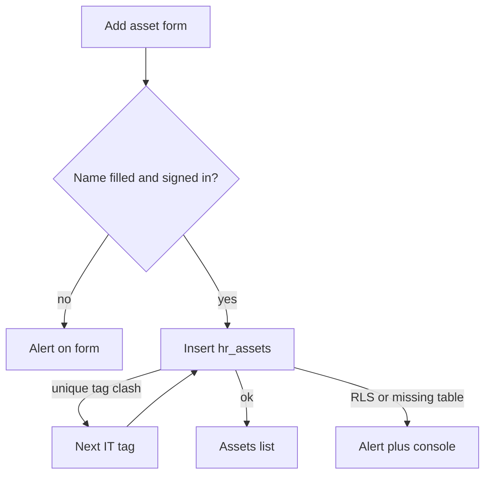
```mermaid
flowchart TD
  User[Add asset form] --> Name{Name filled and signed in?}
  Name -->|no| Alert[Alert on form]
  Name -->|yes| Insert[Insert hr_assets]
  Insert -->|unique tag clash| Retry[Next IT tag]
  Retry --> Insert
  Insert -->|ok| Assets[Assets list]
  Insert -->|RLS or missing table| Fail[Alert plus console]
```

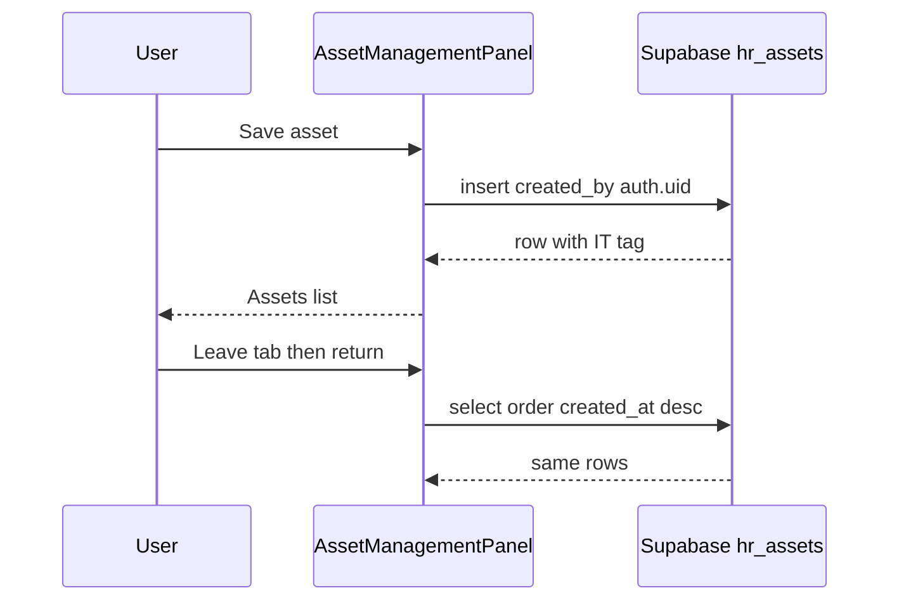
```mermaid
sequenceDiagram
  participant U as User
  participant P as AssetManagementPanel
  participant S as Supabase hr_assets
  U->>P: Save asset
  P->>S: insert created_by auth.uid
  S-->>P: row with IT tag
  P-->>U: Assets list
  U->>P: Leave tab then return
  P->>S: select order created_at desc
  S-->>P: same rows
```

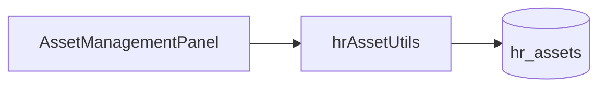
```mermaid
flowchart LR
  Panel[AssetManagementPanel] --> Utils[hrAssetUtils]
  Utils --> Table[(hr_assets)]
```

## Step 0 masters — entity relationships (One Source of Truth)

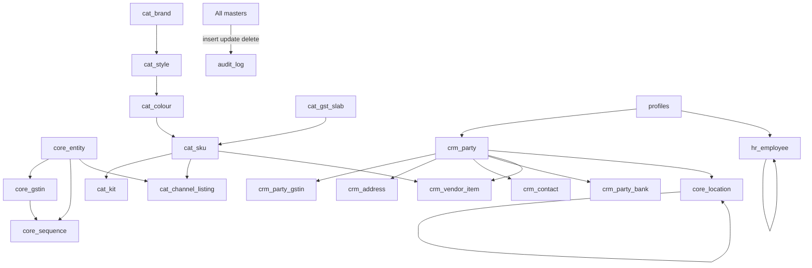
```mermaid
flowchart TD
  core_entity --> core_gstin
  core_entity --> core_sequence
  core_gstin --> core_sequence
  cat_brand --> cat_style
  cat_style --> cat_colour
  cat_colour --> cat_sku
  cat_gst_slab --> cat_sku
  cat_sku --> cat_kit
  cat_sku --> cat_channel_listing
  core_entity --> cat_channel_listing
  crm_party --> crm_party_gstin
  crm_party --> crm_address
  crm_party --> crm_contact
  crm_party --> crm_party_bank
  crm_party --> crm_vendor_item
  cat_sku --> crm_vendor_item
  crm_party --> core_location
  core_location --> core_location
  profiles --> crm_party
  profiles --> hr_employee
  hr_employee --> hr_employee
  Masters[All masters] -->|insert update delete| audit_log
```

## Stock Ledger movement posting (Step 1)

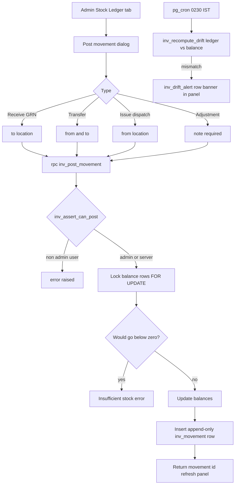
```mermaid
flowchart TD
  Admin[Admin Stock Ledger tab] --> Dialog[Post movement dialog]
  Dialog --> Type{Type}
  Type -->|Receive GRN| ToOnly[to location]
  Type -->|Transfer| Both[from and to]
  Type -->|Issue dispatch| FromOnly[from location]
  Type -->|Adjustment| NoteReq[note required]
  ToOnly --> RPC[rpc inv_post_movement]
  Both --> RPC
  FromOnly --> RPC
  NoteReq --> RPC
  RPC --> Gate{inv_assert_can_post}
  Gate -->|non admin user| Deny[error raised]
  Gate -->|admin or server| Lock[Lock balance rows FOR UPDATE]
  Lock --> Neg{Would go below zero?}
  Neg -->|yes| Deny2[Insufficient stock error]
  Neg -->|no| Apply[Update balances]
  Apply --> Insert[Insert append-only inv_movement row]
  Insert --> Done[Return movement id refresh panel]
  Nightly[pg_cron 0230 IST] --> Drift[inv_recompute_drift ledger vs balance]
  Drift -->|mismatch| AlertRow[inv_drift_alert row banner in panel]
```

## Platform Masters CSV import (dedupe report)

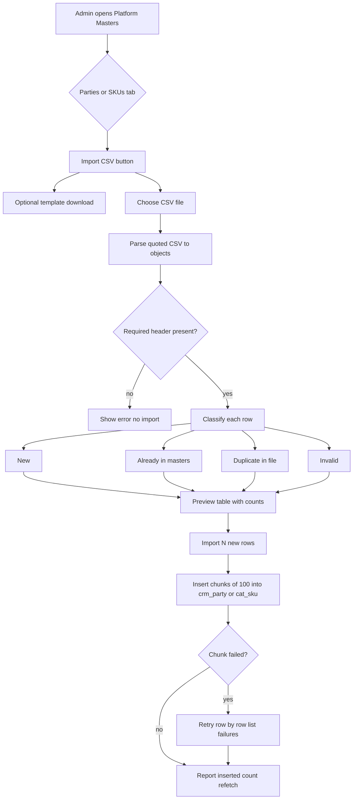
```mermaid
flowchart TD
  Admin[Admin opens Platform Masters] --> Tab{Parties or SKUs tab}
  Tab --> Import[Import CSV button]
  Import --> Template[Optional template download]
  Import --> File[Choose CSV file]
  File --> Parse[Parse quoted CSV to objects]
  Parse --> HeaderOK{Required header present?}
  HeaderOK -->|no| ParseError[Show error no import]
  HeaderOK -->|yes| Classify[Classify each row]
  Classify --> New[New]
  Classify --> DupDb[Already in masters]
  Classify --> DupFile[Duplicate in file]
  Classify --> Invalid[Invalid]
  New --> Preview[Preview table with counts]
  DupDb --> Preview
  DupFile --> Preview
  Invalid --> Preview
  Preview --> Go[Import N new rows]
  Go --> Insert[Insert chunks of 100 into crm_party or cat_sku]
  Insert --> RowFail{Chunk failed?}
  RowFail -->|yes| PerRow[Retry row by row list failures]
  RowFail -->|no| Done[Report inserted count refetch]
  PerRow --> Done
```

## Tools Internal Support Platform

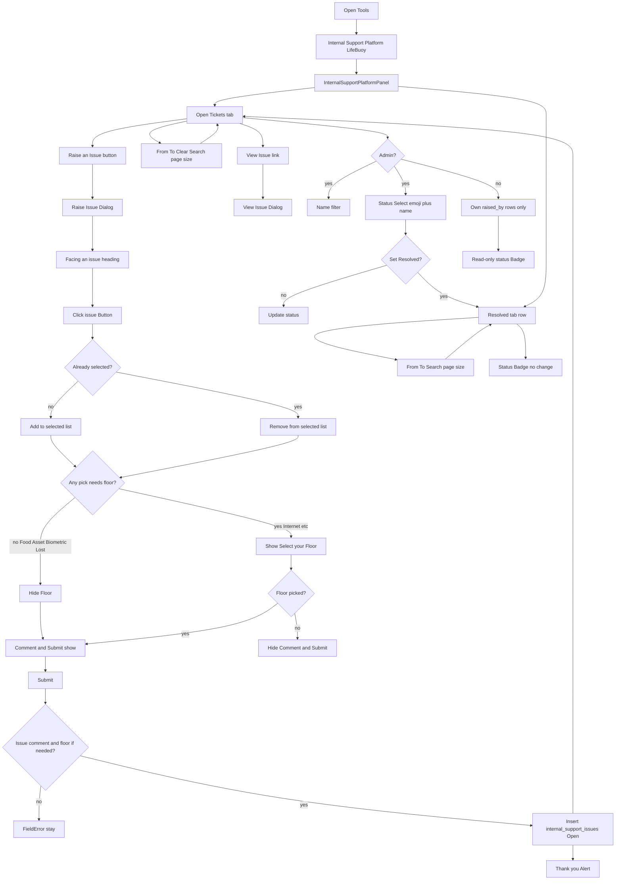
```mermaid
flowchart TD
  User[Open Tools] --> Item[Internal Support Platform LifeBuoy]
  Item --> Panel[InternalSupportPlatformPanel]
  Panel --> OpenTab[Open Tickets tab]
  OpenTab --> RaiseBtn[Raise an Issue button]
  RaiseBtn --> RaiseDlg[Raise Issue Dialog]
  RaiseDlg --> Heading[Facing an issue heading]
  Heading --> Pick[Click issue Button]
  Pick --> Toggle{Already selected?}
  Toggle -->|no| Add[Add to selected list]
  Toggle -->|yes| Remove[Remove from selected list]
  Add --> NeedFloor{Any pick needs floor?}
  Remove --> NeedFloor
  NeedFloor -->|no Food Asset Biometric Lost| HideFloor[Hide Floor]
  HideFloor --> ShowComment[Comment and Submit show]
  NeedFloor -->|yes Internet etc| ShowFloor[Show Select your Floor]
  ShowFloor --> HasFloor{Floor picked?}
  HasFloor -->|no| HideComment[Hide Comment and Submit]
  HasFloor -->|yes| ShowComment
  ShowComment --> Submit[Submit]
  Submit --> Valid{Issue comment and floor if needed?}
  Valid -->|no| Error[FieldError stay]
  Valid -->|yes| Save[Insert internal_support_issues Open]
  Save --> Thanks[Thank you Alert]
  Save --> OpenTab
  OpenTab --> Filters[From To Clear Search page size]
  Filters --> OpenTab
  OpenTab --> ViewBtn[View Issue link]
  ViewBtn --> ViewDlg[View Issue Dialog]
  OpenTab --> Who{Admin?}
  Who -->|yes| NameFilter[Name filter]
  Who -->|yes| StatusPick[Status Select emoji plus name]
  StatusPick --> MarkResolved{Set Resolved?}
  MarkResolved -->|no| Update[Update status]
  MarkResolved -->|yes| ResolvedTab[Resolved tab row]
  Who -->|no| OwnRows[Own raised_by rows only]
  OwnRows --> StatusSee[Read-only status Badge]
  Panel --> ResolvedTab
  ResolvedTab --> ResFilters[From To Search page size]
  ResFilters --> ResolvedTab
  ResolvedTab --> ResLock[Status Badge no change]
```

## Production Tracker sidebar tabs

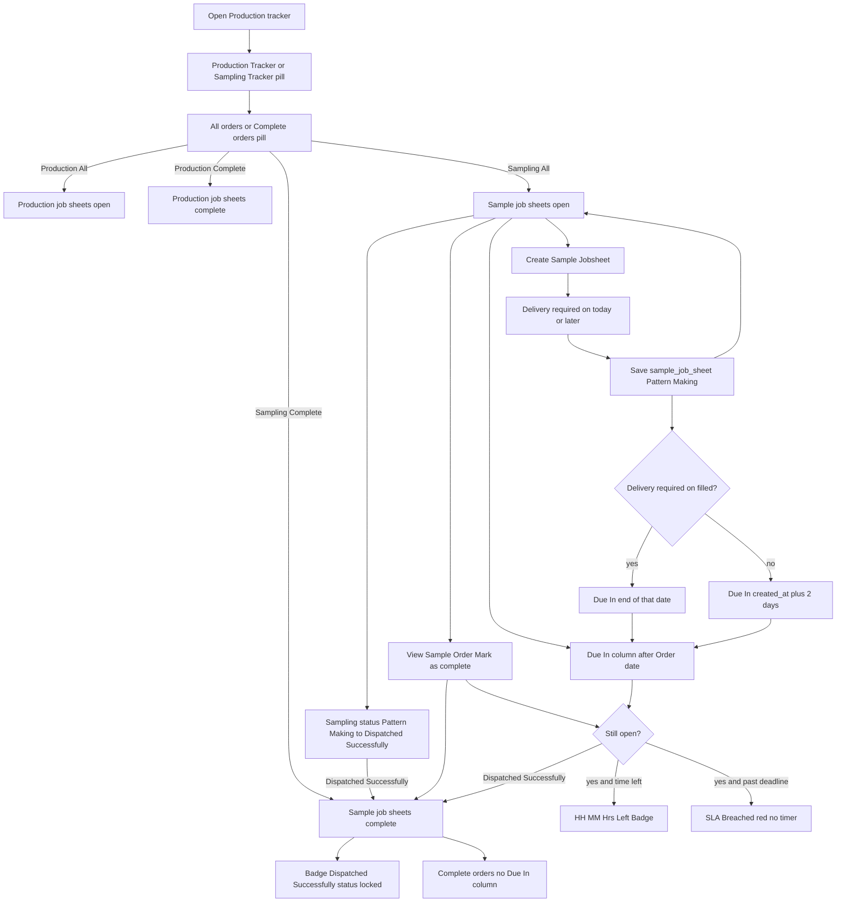
```mermaid
flowchart TD
  User[Open Production tracker] --> Switch[Production Tracker or Sampling Tracker pill]
  Switch --> ListTabs[All orders or Complete orders pill]
  ListTabs -->|Production All| ProdOpen[Production job sheets open]
  ListTabs -->|Production Complete| ProdDone[Production job sheets complete]
  ListTabs -->|Sampling All| SampleOpen[Sample job sheets open]
  ListTabs -->|Sampling Complete| SampleDone[Sample job sheets complete]
  SampleOpen --> StatusPick[Sampling status Pattern Making to Dispatched Successfully]
  StatusPick -->|Dispatched Successfully| SampleDone
  SampleOpen --> ViewSample[View Sample Order Mark as complete]
  ViewSample --> SampleDone
  SampleDone --> LockedStatus[Badge Dispatched Successfully status locked]
  SampleOpen --> SampleForm[Create Sample Jobsheet]
  SampleForm --> DeliveryPick[Delivery required on today or later]
  DeliveryPick --> SampleSave[Save sample_job_sheet Pattern Making]
  SampleSave --> SampleOpen
  SampleSave --> SlaClock{Delivery required on filled?}
  SlaClock -->|yes| DueDateSla[Due In end of that date]
  SlaClock -->|no| DefaultSla[Due In created_at plus 2 days]
  SampleOpen --> ListDueIn[Due In column after Order date]
  DueDateSla --> ListDueIn
  DefaultSla --> ListDueIn
  SampleDone --> NoListDueIn[Complete orders no Due In column]
  ViewSample --> DueIn{Still open?}
  ListDueIn --> DueIn
  DueIn -->|yes and time left| Countdown[HH MM Hrs Left Badge]
  DueIn -->|yes and past deadline| Breach[SLA Breached red no timer]
  DueIn -->|Dispatched Successfully| SampleDone
```

## Enquiry Concierge desk (Dashboard Support tab)

Status UI stays **New / Assigned / In progress / Resolved / Closed**. Concierge pick/SLA runs on top.

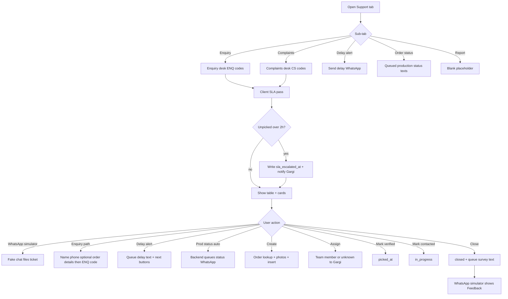
```mermaid
flowchart TD
  A[Open Support tab] --> ST{Sub-tab}
  ST -->|Enquiry| ENQ[Enquiry desk ENQ codes]
  ST -->|Complaints| B[Complaints desk CS codes]
  ST -->|Delay alert| DATab[Send delay WhatsApp]
  ST -->|Order status| OSTab[Queued production status texts]
  ST -->|Report| BL2[Blank placeholder]
  ENQ --> C[Client SLA pass]
  B --> C
  C --> D{Unpicked over 2h?}
  D -->|yes| E[Write sla_escalated_at + notify Gargi]
  D -->|no| F[Show table + cards]
  E --> F
  F --> G{User action}
  G -->|WhatsApp simulator| S[Fake chat files ticket]
  G -->|Enquiry path| EP[Name phone optional order details then ENQ code]
  G -->|Delay alert| DA[Queue delay text + next buttons]
  G -->|Prod status auto| PS[Backend queues status WhatsApp]
  G -->|Create| H[Order lookup + photos + insert]
  G -->|Assign| I[Team member or unknown to Gargi]
  G -->|Mark verified| J[picked_at]
  G -->|Mark contacted| K[in_progress]
  G -->|Close| L[closed + queue survey text]
  L --> M[WhatsApp simulator shows Feedback]
```

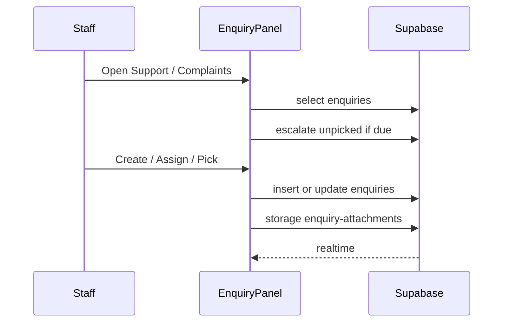
```mermaid
sequenceDiagram
  participant Staff
  participant App as EnquiryPanel
  participant SB as Supabase
  Staff->>App: Open Support / Complaints
  App->>SB: select enquiries
  App->>SB: escalate unpicked if due
  Staff->>App: Create / Assign / Pick
  App->>SB: insert or update enquiries
  App->>SB: storage enquiry-attachments
  SB-->>App: realtime
```

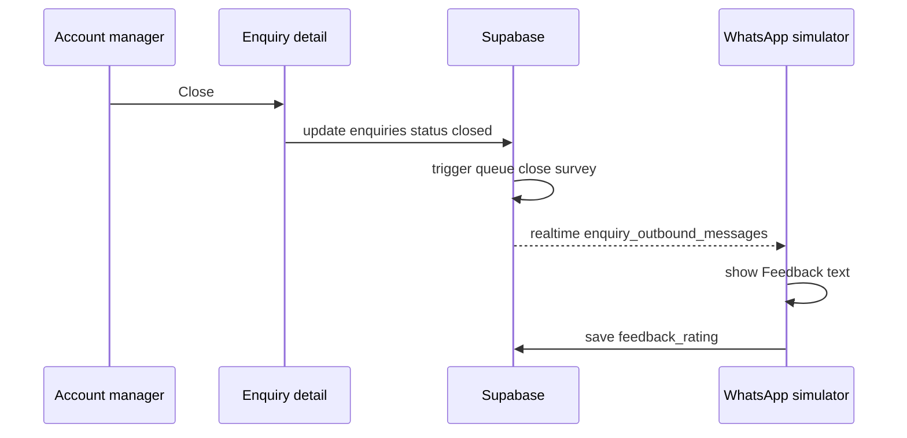
```mermaid
sequenceDiagram
  participant AM as Account manager
  participant App as Enquiry detail
  participant SB as Supabase
  participant Sim as WhatsApp simulator
  AM->>App: Close
  App->>SB: update enquiries status closed
  SB->>SB: trigger queue close survey
  SB-->>Sim: realtime enquiry_outbound_messages
  Sim->>Sim: show Feedback text
  Sim->>SB: save feedback_rating
```

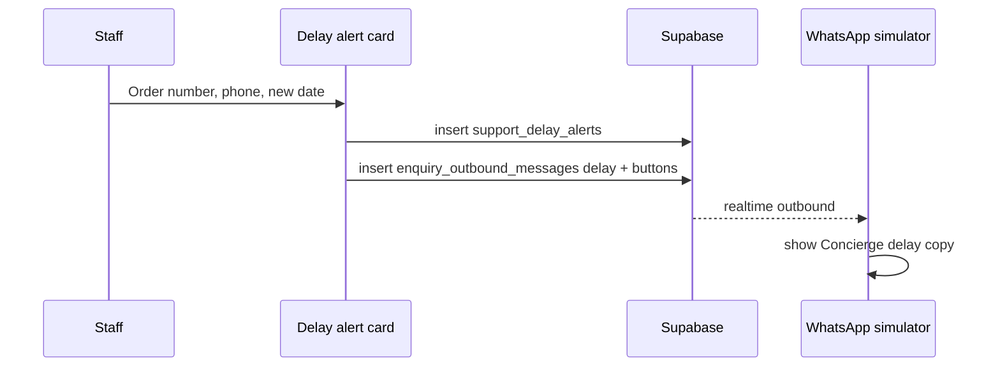
```mermaid
sequenceDiagram
  participant Staff
  participant Card as Delay alert card
  participant SB as Supabase
  participant Sim as WhatsApp simulator
  Staff->>Card: Order number, phone, new date
  Card->>SB: insert support_delay_alerts
  Card->>SB: insert enquiry_outbound_messages delay + buttons
  SB-->>Sim: realtime outbound
  Sim->>Sim: show Concierge delay copy
```

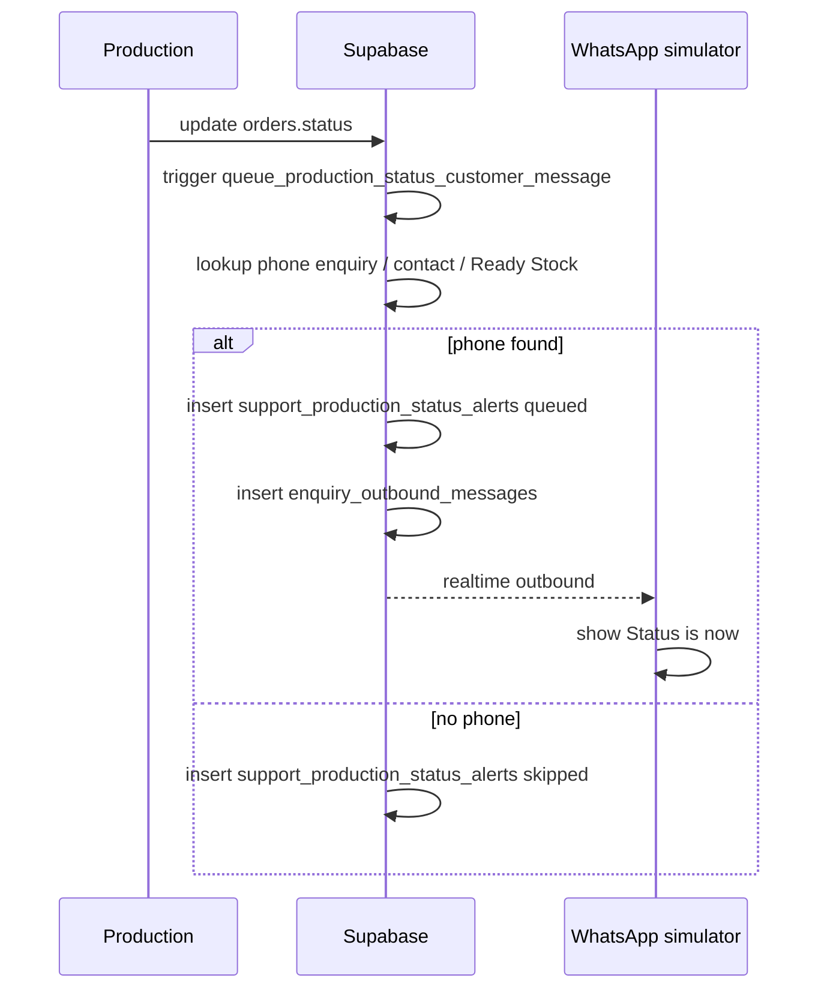
```mermaid
sequenceDiagram
  participant Prod as Production
  participant SB as Supabase
  participant Sim as WhatsApp simulator
  Prod->>SB: update orders.status
  SB->>SB: trigger queue_production_status_customer_message
  SB->>SB: lookup phone enquiry / contact / Ready Stock
  alt phone found
    SB->>SB: insert support_production_status_alerts queued
    SB->>SB: insert enquiry_outbound_messages
    SB-->>Sim: realtime outbound
    Sim->>Sim: show Status is now
  else no phone
    SB->>SB: insert support_production_status_alerts skipped
  end
```

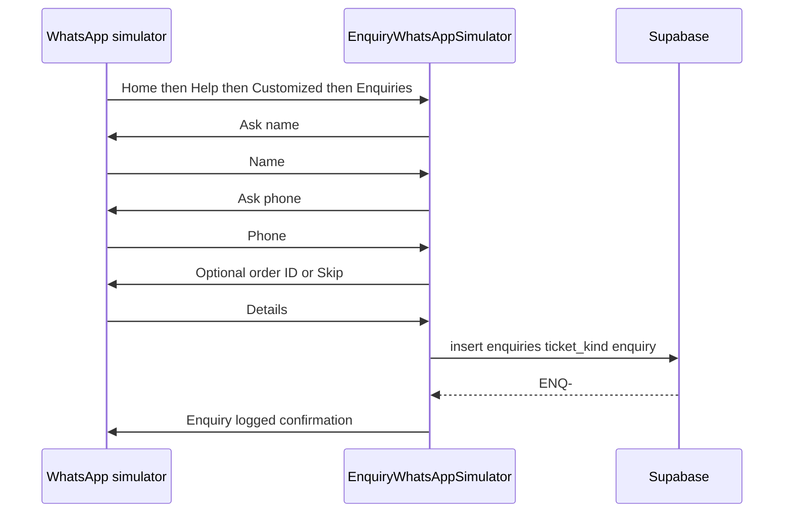
```mermaid
sequenceDiagram
  participant Cust as WhatsApp simulator
  participant App as EnquiryWhatsAppSimulator
  participant SB as Supabase
  Cust->>App: Home then Help then Customized then Enquiries
  App->>Cust: Ask name
  Cust->>App: Name
  App->>Cust: Ask phone
  Cust->>App: Phone
  App->>Cust: Optional order ID or Skip
  Cust->>App: Details
  App->>SB: insert enquiries ticket_kind enquiry
  SB-->>App: ENQ-#####
  App->>Cust: Enquiry logged confirmation
```

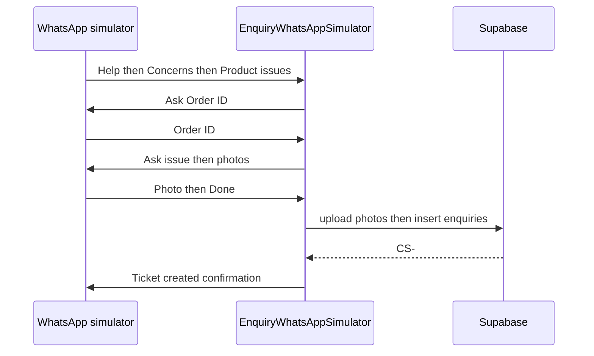
```mermaid
sequenceDiagram
  participant Cust as WhatsApp simulator
  participant App as EnquiryWhatsAppSimulator
  participant SB as Supabase
  Cust->>App: Help then Concerns then Product issues
  App->>Cust: Ask Order ID
  Cust->>App: Order ID
  App->>Cust: Ask issue then photos
  Cust->>App: Photo then Done
  App->>SB: upload photos then insert enquiries
  SB-->>App: CS-#####
  App->>Cust: Ticket created confirmation
```

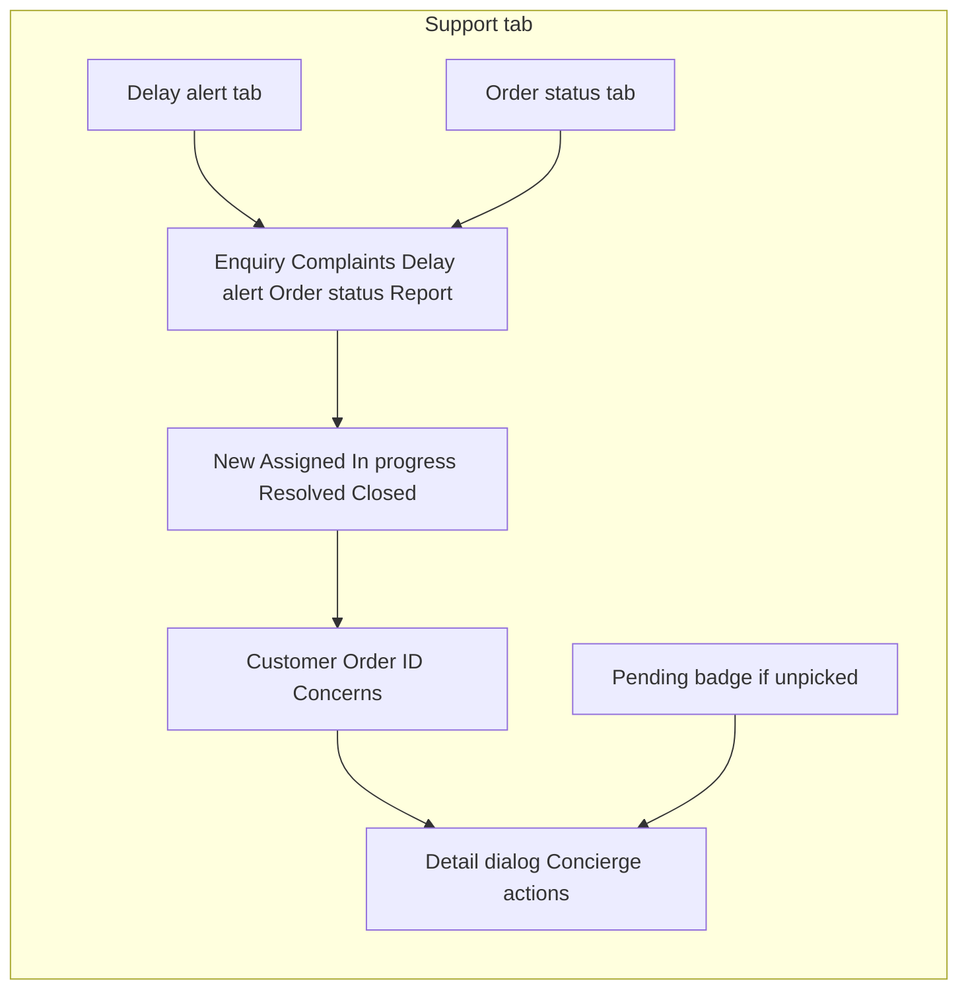
```mermaid
flowchart LR
  subgraph ui [Support tab]
    Cards[New Assigned In progress Resolved Closed]
    Pending[Pending badge if unpicked]
    Detail[Detail dialog Concierge actions]
    Sub[Enquiry Complaints Delay alert Order status Report]
    Delay[Delay alert tab]
    Status[Order status tab]
    Cols[Customer Order ID Concerns]
  end
  Delay --> Sub
  Status --> Sub
  Sub --> Cards
  Cards --> Cols
  Cols --> Detail
  Pending --> Detail
```

## Purchase Order main tab

```mermaid
flowchart TD
  User[Open sidebar] --> PO[Purchase Order tab]
  PO --> OpenTab[All PO Orders Pending PO sent PO Approved]
  PO --> CreateTab[Create new PO sheet after click]
  CreateTab --> Title[PURCHASE ORDER heading]
  CreateTab --> Actions[Generate PO and Print under sheet]
  Actions --> Must[Supplier Description Due Quantity Unit Rate]
  Must -->|empty| Err[Mandatory details are Missing plus red cells]
  Must -->|filled| SaveSent[Write generated_at status po_sent]
  SaveSent --> OpenTab
  PO --> HistTab[PO History Completed only]
  OpenTab --> HistFilter[From To Clear Search Coordinator View N page]
  HistTab --> HistFilter
  HistFilter --> HistRows[Filtered paginated rows]
  HistRows --> ViewPo[View PO A4 heading and table]
  OpenTab --> AdminStatus[Admin status pick Pending PO sent PO Approved Completed]
  Backend[Backend status Completed] --> HistTab
  PO --> Panel[PurchaseOrderPanel]
  Panel --> Plus[Plus new PO]
  Panel --> Grid[Compact unlabeled sheet]
  Grid --> L[R1 R2 R3 stacked left]
  Grid --> R2[R2 tight under R1]
  Grid --> V[Right 4x2 own short rows]
  Grid --> R3[R3 supplier dropdown]
  Grid --> R11[R11 Voucher No plus PO FY seq]
  Grid --> R12[R12 Dated plus today IST]
  Grid --> R31[R31 Reference copies R11 voucher]
  Grid --> R32[R32 Other References type bold]
  Grid --> R41[R41 Dispatched through type bold]
  Grid --> R42[R42 Destination type bold]
  Grid --> R22[R22 Mode terms of Payment 30 days]
  Grid --> TR[R21 R32 R41 R42]
  Grid --> BR[R21B Terms of Delivery plus full textarea]
  Grid --> CTab[C table under R sheet]
  CTab --> CHead[C1 to C8 Sl No Description Due Quantity Rate per Disc Amount]
  CTab --> C21[C21 wide tall empty cell]
  CTab --> SlNo[C11 Sl No 1. 2. 3.]
  CTab --> Desc[C21 type description normal]
  CTab --> Due[C31 calendar icon due date]
  CTab --> Qty[C41 number plus small unit box]
  CTab --> Rate[C51 rate 450.00]
  CTab --> Per[C61 per unit text]
  CTab --> Amt[C81 qty times rate]
  Qty --> Amt
  Rate --> Amt
  Qty --> C42[C42 bold qty total]
  Amt --> C82[C82 bold one line rupee total]
  C82 --> C13
  Qty --> Per
  CTab --> LineAdd[Hover left + add line row]
  CTab --> LineDel[Hover extra row left minus]
  CTab --> C12[C12 to C82 eight tiles]
  CTab --> C22[C22 bold Total]
  CTab --> C13[C13 Amount Chargable in words height like R2]
  CTab --> C23[Print-only C23 signature C42 to C82 height R22]
  C23 --> PrintBtn[Print button]
  Plus --> Alloc[Next seq for current FY]
  Alloc --> R11
  Alloc --> R12
  Alloc --> R31
```

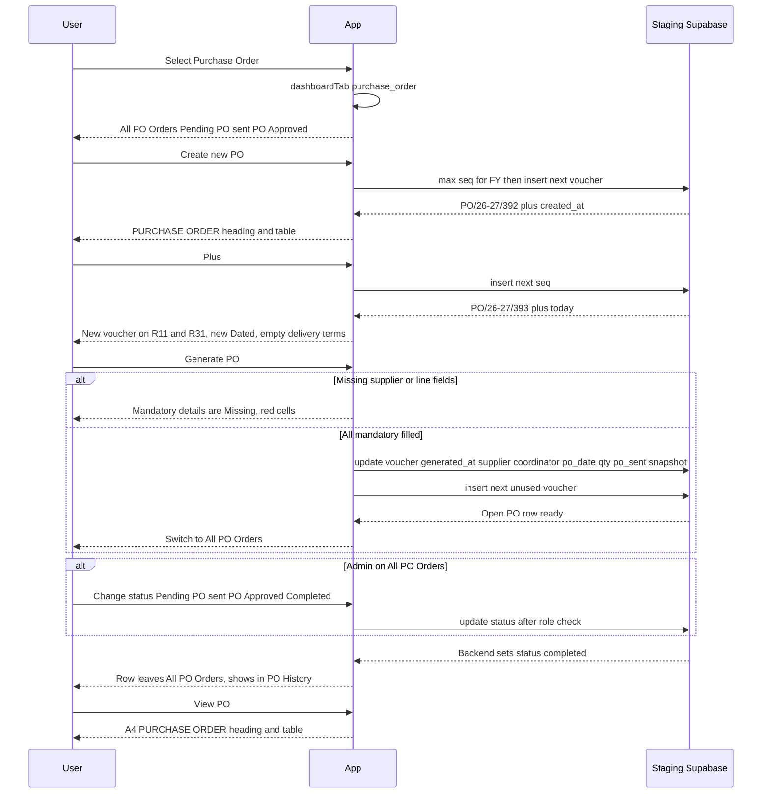
```mermaid
sequenceDiagram
  participant User
  participant App
  participant SB as Staging Supabase
  User->>App: Select Purchase Order
  App->>App: dashboardTab purchase_order
  App-->>User: All PO Orders Pending PO sent PO Approved
  User->>App: Create new PO
  App->>SB: max seq for FY then insert next voucher
  SB-->>App: PO/26-27/392 plus created_at
  App-->>User: PURCHASE ORDER heading and table
  User->>App: Plus
  App->>SB: insert next seq
  SB-->>App: PO/26-27/393 plus today
  App-->>User: New voucher on R11 and R31, new Dated, empty delivery terms
  User->>App: Generate PO
  alt Missing supplier or line fields
    App-->>User: Mandatory details are Missing, red cells
  else All mandatory filled
    App->>SB: update voucher generated_at supplier coordinator po_date qty po_sent snapshot
    App->>SB: insert next unused voucher
    SB-->>App: Open PO row ready
    App-->>User: Switch to All PO Orders
  end
  alt Admin on All PO Orders
    User->>App: Change status Pending PO sent PO Approved Completed
    App->>SB: update status after role check
  end
  SB-->>App: Backend sets status completed
  App-->>User: Row leaves All PO Orders, shows in PO History
  User->>App: View PO
  App-->>User: A4 PURCHASE ORDER heading and table
```
