# Flowcharts

## Asset Management save to register

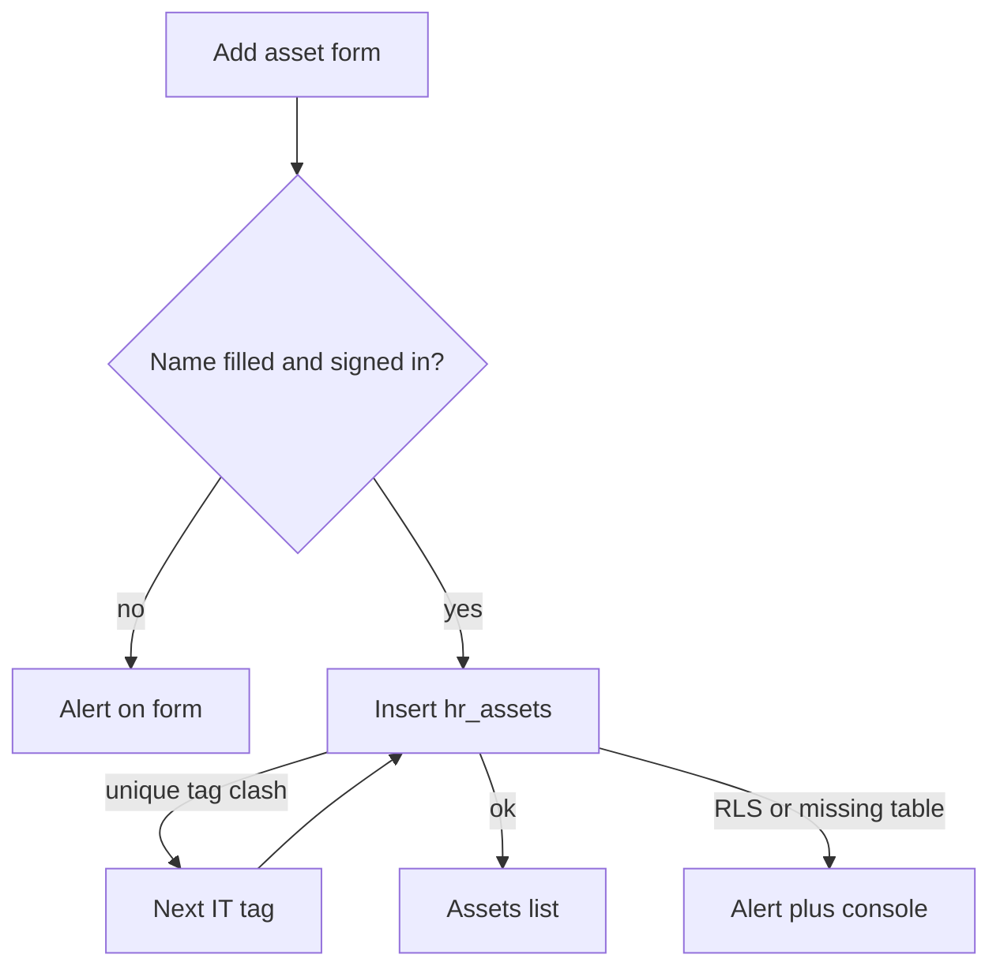
```mermaid
flowchart TD
  User[Add asset form] --> Name{Name filled and signed in?}
  Name -->|no| Alert[Alert on form]
  Name -->|yes| Insert[Insert hr_assets]
  Insert -->|unique tag clash| Retry[Next IT tag]
  Retry --> Insert
  Insert -->|ok| Assets[Assets list]
  Insert -->|RLS or missing table| Fail[Alert plus console]
```

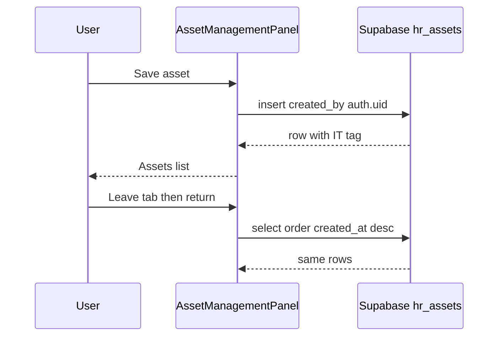
```mermaid
sequenceDiagram
  participant U as User
  participant P as AssetManagementPanel
  participant S as Supabase hr_assets
  U->>P: Save asset
  P->>S: insert created_by auth.uid
  S-->>P: row with IT tag
  P-->>U: Assets list
  U->>P: Leave tab then return
  P->>S: select order created_at desc
  S-->>P: same rows
```

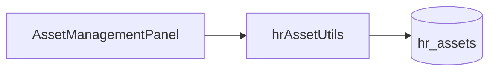
```mermaid
flowchart LR
  Panel[AssetManagementPanel] --> Utils[hrAssetUtils]
  Utils --> Table[(hr_assets)]
```

## View order mockup and asset preview

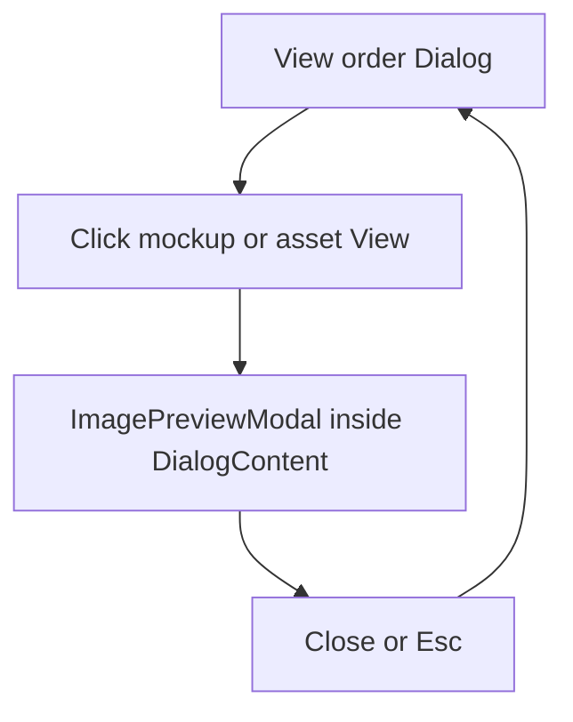
```mermaid
flowchart TD
  Open[View order Dialog] --> Click[Click mockup or asset View]
  Click --> Overlay[ImagePreviewModal inside DialogContent]
  Overlay --> CloseBtn[Close or Esc]
  CloseBtn --> Open
```

## Printing status, mark complete stay, Sent to Dispatch auto-complete

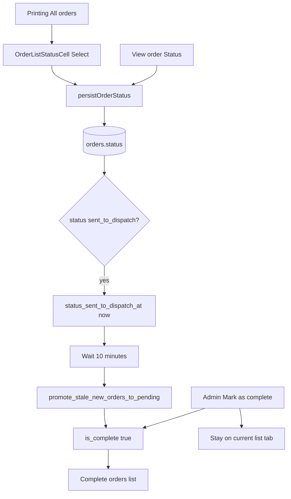
```mermaid
flowchart TD
  List[Printing All orders] --> Cell[OrderListStatusCell Select]
  Cell --> Persist[persistOrderStatus]
  View[View order Status] --> Persist
  Persist --> Orders[(orders.status)]
  Dispatch{status sent_to_dispatch?}
  Orders --> Dispatch
  Dispatch -->|yes| Stamp[status_sent_to_dispatch_at now]
  Stamp --> Wait[Wait 10 minutes]
  Wait --> Rpc[promote_stale_new_orders_to_pending]
  Rpc --> Complete[is_complete true]
  Complete --> CompleteTab[Complete orders list]
  Mark[Admin Mark as complete] --> Complete
  Mark --> Stay[Stay on current list tab]
```

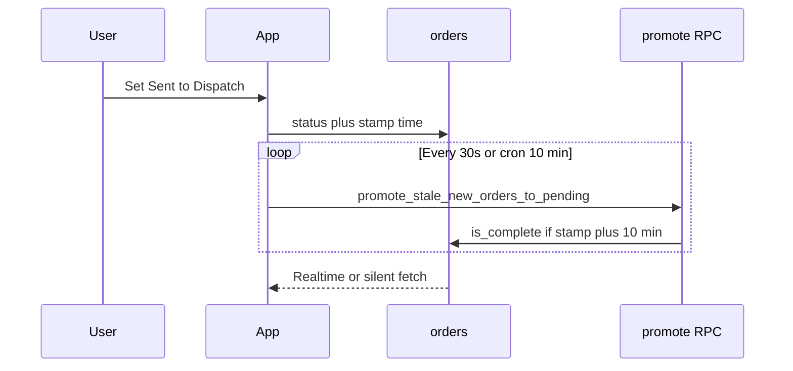
```mermaid
sequenceDiagram
  participant U as User
  participant A as App
  participant D as orders
  participant R as promote RPC
  U->>A: Set Sent to Dispatch
  A->>D: status plus stamp time
  loop Every 30s or cron 10 min
    A->>R: promote_stale_new_orders_to_pending
    R->>D: is_complete if stamp plus 10 min
  end
  D-->>A: Realtime or silent fetch
```

## Inventory facility transfer

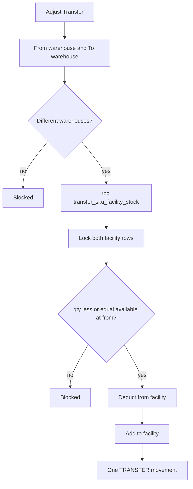
```mermaid
flowchart TD
  Pick[Adjust Transfer] --> FromTo[From warehouse and To warehouse]
  FromTo --> Same{Different warehouses?}
  Same -->|no| Block1[Blocked]
  Same -->|yes| Rpc[rpc transfer_sku_facility_stock]
  Rpc --> Lock[Lock both facility rows]
  Lock --> Avail{qty less or equal available at from?}
  Avail -->|no| Block2[Blocked]
  Avail -->|yes| Deduct[Deduct from facility]
  Deduct --> Add[Add to facility]
  Add --> Move[One TRANSFER movement]
```

## Uniware bridge (Step 5)

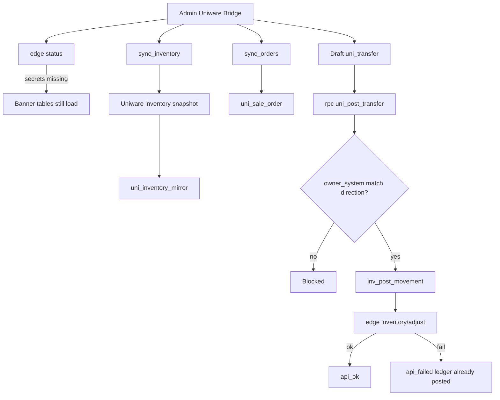
```mermaid
flowchart TD
  Admin[Admin Uniware Bridge] --> Status[edge status]
  Status -->|secrets missing| Banner[Banner tables still load]
  Admin --> SyncInv[sync_inventory]
  SyncInv --> Snap[Uniware inventory snapshot]
  Snap --> Mirror[uni_inventory_mirror]
  Admin --> SyncOrd[sync_orders]
  SyncOrd --> So[uni_sale_order]
  Admin --> Draft[Draft uni_transfer]
  Draft --> Post[rpc uni_post_transfer]
  Post --> Owners{owner_system match direction?}
  Owners -->|no| Block[Blocked]
  Owners -->|yes| Move[inv_post_movement]
  Move --> Adj[edge inventory/adjust]
  Adj -->|ok| ApiOk[api_ok]
  Adj -->|fail| ApiFail[api_failed ledger already posted]
```

## Billing lifecycle (Step 4)

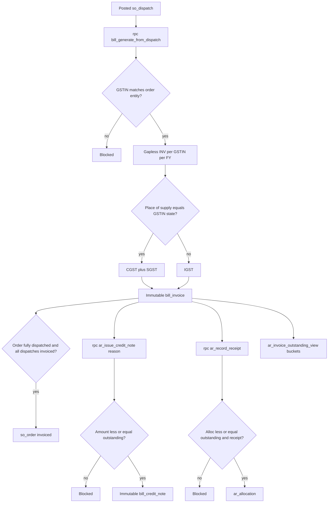
```mermaid
flowchart TD
  Disp[Posted so_dispatch] --> Gen[rpc bill_generate_from_dispatch]
  Gen --> Gstin{GSTIN matches order entity?}
  Gstin -->|no| Err1[Blocked]
  Gstin -->|yes| Num[Gapless INV per GSTIN per FY]
  Num --> Pos{Place of supply equals GSTIN state?}
  Pos -->|yes| Intra[CGST plus SGST]
  Pos -->|no| Inter[IGST]
  Intra --> Inv[Immutable bill_invoice]
  Inter --> Inv
  Inv --> AllDisp{Order fully dispatched and all dispatches invoiced?}
  AllDisp -->|yes| Invoiced[so_order invoiced]
  Inv --> Cn[rpc ar_issue_credit_note reason]
  Cn --> Cap1{Amount less or equal outstanding?}
  Cap1 -->|no| Err2[Blocked]
  Cap1 -->|yes| CnDoc[Immutable bill_credit_note]
  Inv --> Rcpt[rpc ar_record_receipt]
  Rcpt --> Cap2{Alloc less or equal outstanding and receipt?}
  Cap2 -->|no| Err3[Blocked]
  Cap2 -->|yes| Alloc[ar_allocation]
  Inv --> Age[ar_invoice_outstanding_view buckets]
```

## Sales order lifecycle (Step 3)

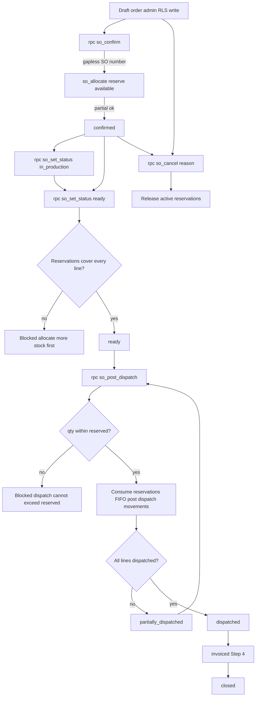
```mermaid
flowchart TD
  Draft[Draft order admin RLS write] --> Confirm[rpc so_confirm]
  Confirm -->|gapless SO number| Alloc[so_allocate reserve available]
  Alloc -->|partial ok| Confirmed[confirmed]
  Confirmed --> Prod[rpc so_set_status in_production]
  Prod --> ReadyTry[rpc so_set_status ready]
  Confirmed --> ReadyTry
  ReadyTry --> Gate{Reservations cover every line?}
  Gate -->|no| Blocked[Blocked allocate more stock first]
  Gate -->|yes| Ready[ready]
  Ready --> Disp[rpc so_post_dispatch]
  Disp --> Cap{qty within reserved?}
  Cap -->|no| Err[Blocked dispatch cannot exceed reserved]
  Cap -->|yes| Consume[Consume reservations FIFO post dispatch movements]
  Consume --> Open{All lines dispatched?}
  Open -->|no| Partial[partially_dispatched] --> Disp
  Open -->|yes| Dispatched[dispatched] --> Invoice[invoiced Step 4] --> Closed[closed]
  Draft --> Cancel[rpc so_cancel reason]
  Confirmed --> Cancel
  Cancel --> Release[Release active reservations]
```

## Job work round trip (Step 3)

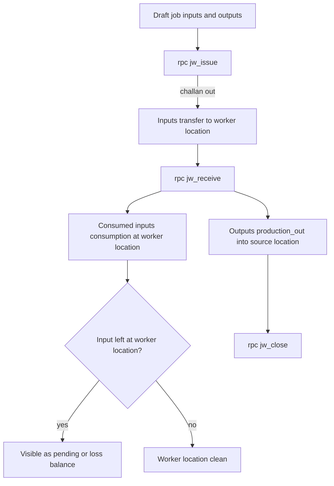
```mermaid
flowchart TD
  JDraft[Draft job inputs and outputs] --> Issue[rpc jw_issue]
  Issue -->|challan out| Worker[Inputs transfer to worker location]
  Worker --> Receive[rpc jw_receive]
  Receive --> Out[Outputs production_out into source location]
  Receive --> Burn[Consumed inputs consumption at worker location]
  Burn --> Left{Input left at worker location?}
  Left -->|yes| Loss[Visible as pending or loss balance]
  Left -->|no| Clean[Worker location clean]
  Out --> Close[rpc jw_close]
```

## Procurement lifecycle (Step 2)

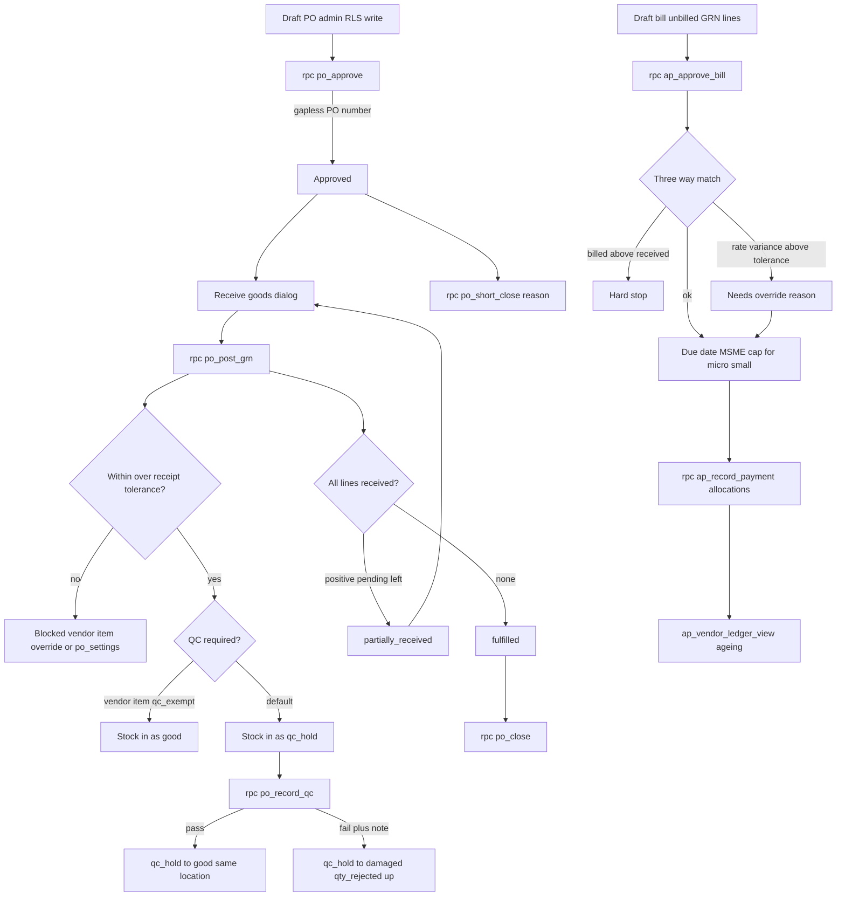
```mermaid
flowchart TD
  Draft[Draft PO admin RLS write] --> Approve[rpc po_approve]
  Approve -->|gapless PO number| Open[Approved]
  Open --> Receive[Receive goods dialog]
  Receive --> PostGrn[rpc po_post_grn]
  PostGrn --> Tol{Within over receipt tolerance?}
  Tol -->|no| Err1[Blocked vendor item override or po_settings]
  Tol -->|yes| QcGate{QC required?}
  QcGate -->|vendor item qc_exempt| Good[Stock in as good]
  QcGate -->|default| Hold[Stock in as qc_hold]
  Hold --> Qc[rpc po_record_qc]
  Qc -->|pass| StateGood[qc_hold to good same location]
  Qc -->|fail plus note| StateDam[qc_hold to damaged qty_rejected up]
  PostGrn --> Status{All lines received?}
  Status -->|positive pending left| Partial[partially_received]
  Status -->|none| Fulfilled[fulfilled] --> Close[rpc po_close]
  Partial --> Receive
  Open --> Short[rpc po_short_close reason] 
  Bill[Draft bill unbilled GRN lines] --> ApproveBill[rpc ap_approve_bill]
  ApproveBill --> Match{Three way match}
  Match -->|billed above received| Hard[Hard stop]
  Match -->|rate variance above tolerance| Override[Needs override reason]
  Match -->|ok| Due[Due date MSME cap for micro small]
  Due --> Pay[rpc ap_record_payment allocations]
  Override --> Due
  Pay --> Ledger[ap_vendor_ledger_view ageing]
```

## Step 0 masters — entity relationships (One Source of Truth)

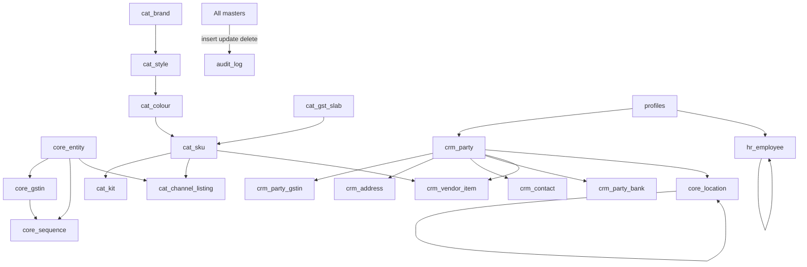
```mermaid
flowchart TD
  core_entity --> core_gstin
  core_entity --> core_sequence
  core_gstin --> core_sequence
  cat_brand --> cat_style
  cat_style --> cat_colour
  cat_colour --> cat_sku
  cat_gst_slab --> cat_sku
  cat_sku --> cat_kit
  cat_sku --> cat_channel_listing
  core_entity --> cat_channel_listing
  crm_party --> crm_party_gstin
  crm_party --> crm_address
  crm_party --> crm_contact
  crm_party --> crm_party_bank
  crm_party --> crm_vendor_item
  cat_sku --> crm_vendor_item
  crm_party --> core_location
  core_location --> core_location
  profiles --> crm_party
  profiles --> hr_employee
  hr_employee --> hr_employee
  Masters[All masters] -->|insert update delete| audit_log
```

## Stock Ledger movement posting (Step 1)

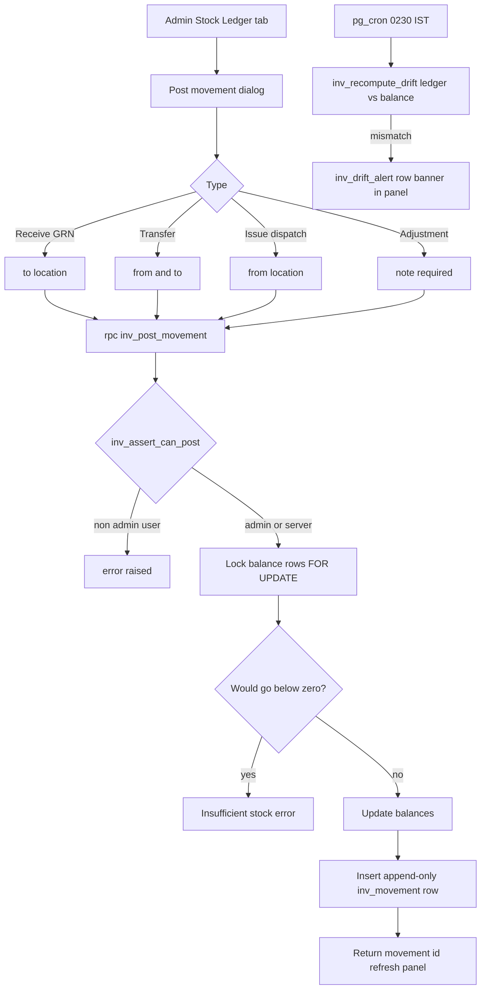
```mermaid
flowchart TD
  Admin[Admin Stock Ledger tab] --> Dialog[Post movement dialog]
  Dialog --> Type{Type}
  Type -->|Receive GRN| ToOnly[to location]
  Type -->|Transfer| Both[from and to]
  Type -->|Issue dispatch| FromOnly[from location]
  Type -->|Adjustment| NoteReq[note required]
  ToOnly --> RPC[rpc inv_post_movement]
  Both --> RPC
  FromOnly --> RPC
  NoteReq --> RPC
  RPC --> Gate{inv_assert_can_post}
  Gate -->|non admin user| Deny[error raised]
  Gate -->|admin or server| Lock[Lock balance rows FOR UPDATE]
  Lock --> Neg{Would go below zero?}
  Neg -->|yes| Deny2[Insufficient stock error]
  Neg -->|no| Apply[Update balances]
  Apply --> Insert[Insert append-only inv_movement row]
  Insert --> Done[Return movement id refresh panel]
  Nightly[pg_cron 0230 IST] --> Drift[inv_recompute_drift ledger vs balance]
  Drift -->|mismatch| AlertRow[inv_drift_alert row banner in panel]
```

## Platform Masters CSV import (dedupe report)

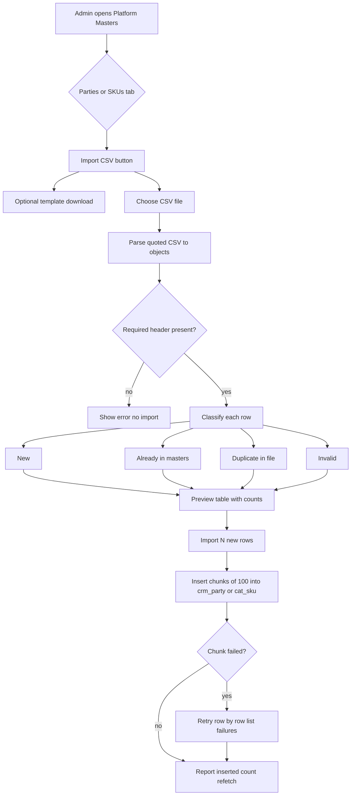
```mermaid
flowchart TD
  Admin[Admin opens Platform Masters] --> Tab{Parties or SKUs tab}
  Tab --> Import[Import CSV button]
  Import --> Template[Optional template download]
  Import --> File[Choose CSV file]
  File --> Parse[Parse quoted CSV to objects]
  Parse --> HeaderOK{Required header present?}
  HeaderOK -->|no| ParseError[Show error no import]
  HeaderOK -->|yes| Classify[Classify each row]
  Classify --> New[New]
  Classify --> DupDb[Already in masters]
  Classify --> DupFile[Duplicate in file]
  Classify --> Invalid[Invalid]
  New --> Preview[Preview table with counts]
  DupDb --> Preview
  DupFile --> Preview
  Invalid --> Preview
  Preview --> Go[Import N new rows]
  Go --> Insert[Insert chunks of 100 into crm_party or cat_sku]
  Insert --> RowFail{Chunk failed?}
  RowFail -->|yes| PerRow[Retry row by row list failures]
  RowFail -->|no| Done[Report inserted count refetch]
  PerRow --> Done
```

## Tools Internal Support Platform

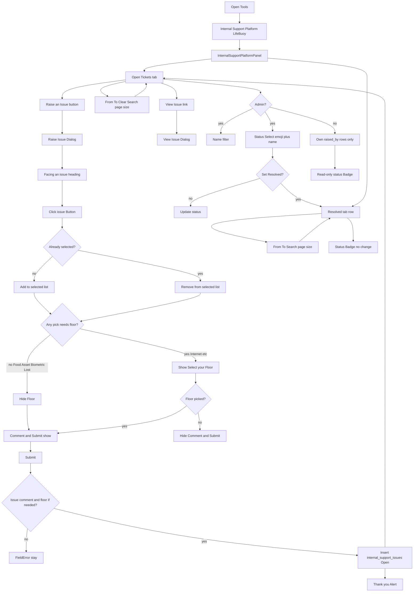
```mermaid
flowchart TD
  User[Open Tools] --> Item[Internal Support Platform LifeBuoy]
  Item --> Panel[InternalSupportPlatformPanel]
  Panel --> OpenTab[Open Tickets tab]
  OpenTab --> RaiseBtn[Raise an Issue button]
  RaiseBtn --> RaiseDlg[Raise Issue Dialog]
  RaiseDlg --> Heading[Facing an issue heading]
  Heading --> Pick[Click issue Button]
  Pick --> Toggle{Already selected?}
  Toggle -->|no| Add[Add to selected list]
  Toggle -->|yes| Remove[Remove from selected list]
  Add --> NeedFloor{Any pick needs floor?}
  Remove --> NeedFloor
  NeedFloor -->|no Food Asset Biometric Lost| HideFloor[Hide Floor]
  HideFloor --> ShowComment[Comment and Submit show]
  NeedFloor -->|yes Internet etc| ShowFloor[Show Select your Floor]
  ShowFloor --> HasFloor{Floor picked?}
  HasFloor -->|no| HideComment[Hide Comment and Submit]
  HasFloor -->|yes| ShowComment
  ShowComment --> Submit[Submit]
  Submit --> Valid{Issue comment and floor if needed?}
  Valid -->|no| Error[FieldError stay]
  Valid -->|yes| Save[Insert internal_support_issues Open]
  Save --> Thanks[Thank you Alert]
  Save --> OpenTab
  OpenTab --> Filters[From To Clear Search page size]
  Filters --> OpenTab
  OpenTab --> ViewBtn[View Issue link]
  ViewBtn --> ViewDlg[View Issue Dialog]
  OpenTab --> Who{Admin?}
  Who -->|yes| NameFilter[Name filter]
  Who -->|yes| StatusPick[Status Select emoji plus name]
  StatusPick --> MarkResolved{Set Resolved?}
  MarkResolved -->|no| Update[Update status]
  MarkResolved -->|yes| ResolvedTab[Resolved tab row]
  Who -->|no| OwnRows[Own raised_by rows only]
  OwnRows --> StatusSee[Read-only status Badge]
  Panel --> ResolvedTab
  ResolvedTab --> ResFilters[From To Search page size]
  ResFilters --> ResolvedTab
  ResolvedTab --> ResLock[Status Badge no change]
```

## Production Tracker sidebar tabs

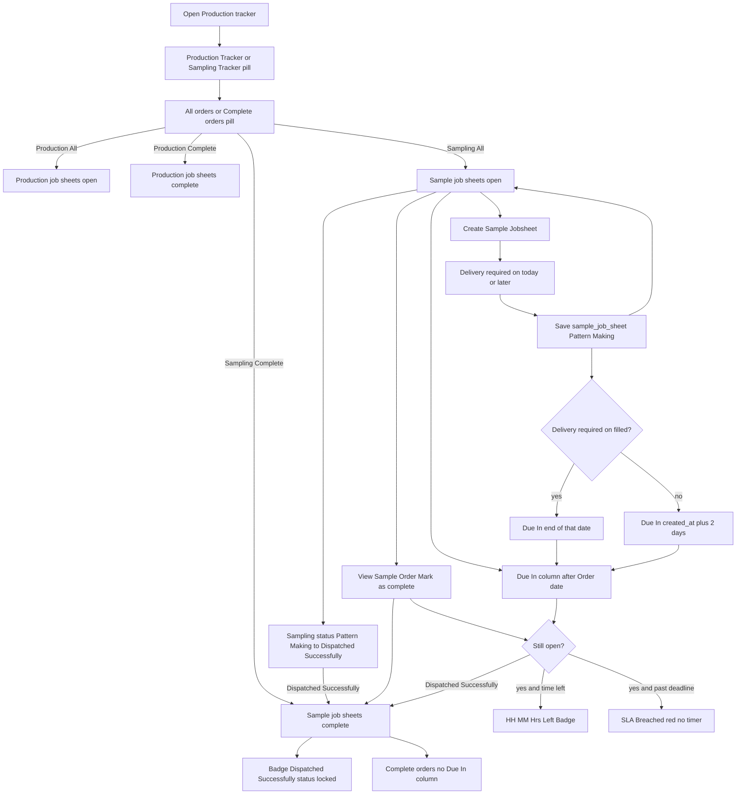
```mermaid
flowchart TD
  User[Open Production tracker] --> Switch[Production Tracker or Sampling Tracker pill]
  Switch --> ListTabs[All orders or Complete orders pill]
  ListTabs -->|Production All| ProdOpen[Production job sheets open]
  ListTabs -->|Production Complete| ProdDone[Production job sheets complete]
  ListTabs -->|Sampling All| SampleOpen[Sample job sheets open]
  ListTabs -->|Sampling Complete| SampleDone[Sample job sheets complete]
  SampleOpen --> StatusPick[Sampling status Pattern Making to Dispatched Successfully]
  StatusPick -->|Dispatched Successfully| SampleDone
  SampleOpen --> ViewSample[View Sample Order Mark as complete]
  ViewSample --> SampleDone
  SampleDone --> LockedStatus[Badge Dispatched Successfully status locked]
  SampleOpen --> SampleForm[Create Sample Jobsheet]
  SampleForm --> DeliveryPick[Delivery required on today or later]
  DeliveryPick --> SampleSave[Save sample_job_sheet Pattern Making]
  SampleSave --> SampleOpen
  SampleSave --> SlaClock{Delivery required on filled?}
  SlaClock -->|yes| DueDateSla[Due In end of that date]
  SlaClock -->|no| DefaultSla[Due In created_at plus 2 days]
  SampleOpen --> ListDueIn[Due In column after Order date]
  DueDateSla --> ListDueIn
  DefaultSla --> ListDueIn
  SampleDone --> NoListDueIn[Complete orders no Due In column]
  ViewSample --> DueIn{Still open?}
  ListDueIn --> DueIn
  DueIn -->|yes and time left| Countdown[HH MM Hrs Left Badge]
  DueIn -->|yes and past deadline| Breach[SLA Breached red no timer]
  DueIn -->|Dispatched Successfully| SampleDone
```

## Enquiry Concierge desk (Dashboard Support tab)

Status UI stays **New / Assigned / In progress / Resolved / Closed**. Concierge pick/SLA runs on top.

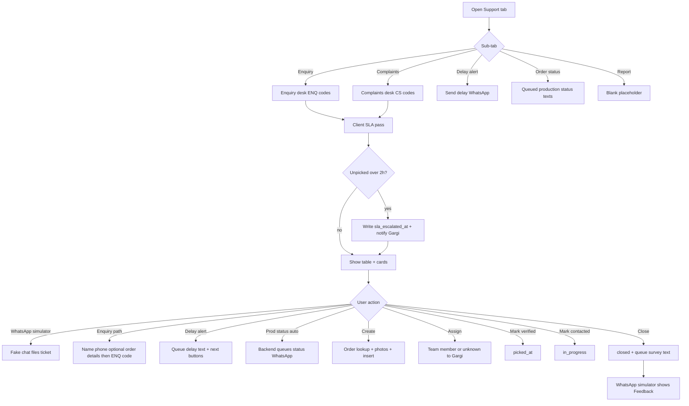
```mermaid
flowchart TD
  A[Open Support tab] --> ST{Sub-tab}
  ST -->|Enquiry| ENQ[Enquiry desk ENQ codes]
  ST -->|Complaints| B[Complaints desk CS codes]
  ST -->|Delay alert| DATab[Send delay WhatsApp]
  ST -->|Order status| OSTab[Queued production status texts]
  ST -->|Report| BL2[Blank placeholder]
  ENQ --> C[Client SLA pass]
  B --> C
  C --> D{Unpicked over 2h?}
  D -->|yes| E[Write sla_escalated_at + notify Gargi]
  D -->|no| F[Show table + cards]
  E --> F
  F --> G{User action}
  G -->|WhatsApp simulator| S[Fake chat files ticket]
  G -->|Enquiry path| EP[Name phone optional order details then ENQ code]
  G -->|Delay alert| DA[Queue delay text + next buttons]
  G -->|Prod status auto| PS[Backend queues status WhatsApp]
  G -->|Create| H[Order lookup + photos + insert]
  G -->|Assign| I[Team member or unknown to Gargi]
  G -->|Mark verified| J[picked_at]
  G -->|Mark contacted| K[in_progress]
  G -->|Close| L[closed + queue survey text]
  L --> M[WhatsApp simulator shows Feedback]
```

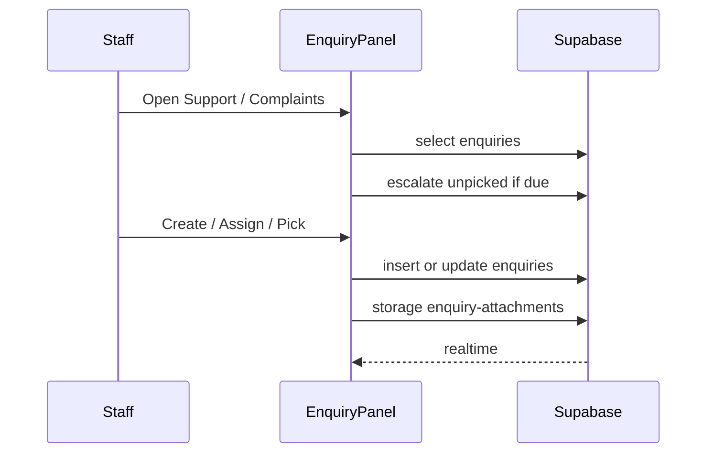
```mermaid
sequenceDiagram
  participant Staff
  participant App as EnquiryPanel
  participant SB as Supabase
  Staff->>App: Open Support / Complaints
  App->>SB: select enquiries
  App->>SB: escalate unpicked if due
  Staff->>App: Create / Assign / Pick
  App->>SB: insert or update enquiries
  App->>SB: storage enquiry-attachments
  SB-->>App: realtime
```

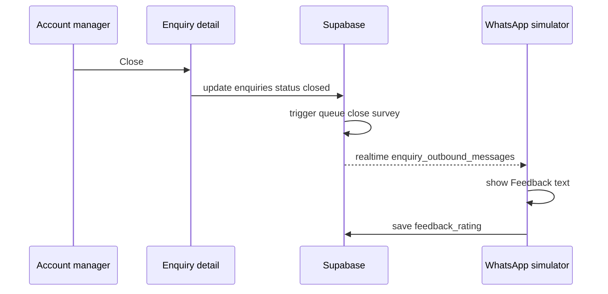
```mermaid
sequenceDiagram
  participant AM as Account manager
  participant App as Enquiry detail
  participant SB as Supabase
  participant Sim as WhatsApp simulator
  AM->>App: Close
  App->>SB: update enquiries status closed
  SB->>SB: trigger queue close survey
  SB-->>Sim: realtime enquiry_outbound_messages
  Sim->>Sim: show Feedback text
  Sim->>SB: save feedback_rating
```

```mermaid
sequenceDiagram
  participant Staff
  participant Card as Delay alert card
  participant SB as Supabase
  participant Sim as WhatsApp simulator
  Staff->>Card: Order number, phone, new date
  Card->>SB: insert support_delay_alerts
  Card->>SB: insert enquiry_outbound_messages delay + buttons
  SB-->>Sim: realtime outbound
  Sim->>Sim: show Concierge delay copy
```

```mermaid
sequenceDiagram
  participant Prod as Production
  participant SB as Supabase
  participant Sim as WhatsApp simulator
  Prod->>SB: update orders.status
  SB->>SB: trigger queue_production_status_customer_message
  SB->>SB: lookup phone enquiry / contact / Ready Stock
  alt phone found
    SB->>SB: insert support_production_status_alerts queued
    SB->>SB: insert enquiry_outbound_messages
    SB-->>Sim: realtime outbound
    Sim->>Sim: show Status is now
  else no phone
    SB->>SB: insert support_production_status_alerts skipped
  end
```

```mermaid
sequenceDiagram
  participant Cust as WhatsApp simulator
  participant App as EnquiryWhatsAppSimulator
  participant SB as Supabase
  Cust->>App: Home then Help then Customized then Enquiries
  App->>Cust: Ask name
  Cust->>App: Name
  App->>Cust: Ask phone
  Cust->>App: Phone
  App->>Cust: Optional order ID or Skip
  Cust->>App: Details
  App->>SB: insert enquiries ticket_kind enquiry
  SB-->>App: ENQ-#####
  App->>Cust: Enquiry logged confirmation
```

```mermaid
sequenceDiagram
  participant Cust as WhatsApp simulator
  participant App as EnquiryWhatsAppSimulator
  participant SB as Supabase
  Cust->>App: Help then Concerns then Product issues
  App->>Cust: Ask Order ID
  Cust->>App: Order ID
  App->>Cust: Ask issue then photos
  Cust->>App: Photo then Done
  App->>SB: upload photos then insert enquiries
  SB-->>App: CS-#####
  App->>Cust: Ticket created confirmation
```

```mermaid
flowchart LR
  subgraph ui [Support tab]
    Cards[New Assigned In progress Resolved Closed]
    Pending[Pending badge if unpicked]
    Detail[Detail dialog Concierge actions]
    Sub[Enquiry Complaints Delay alert Order status Report]
    Delay[Delay alert tab]
    Status[Order status tab]
    Cols[Customer Order ID Concerns]
  end
  Delay --> Sub
  Status --> Sub
  Sub --> Cards
  Cards --> Cols
  Cols --> Detail
  Pending --> Detail
```

## Purchase Order main tab

```mermaid
flowchart TD
  User[Open sidebar] --> PO[Purchase Order tab]
  PO --> OpenTab[All PO Orders Pending PO sent PO Approved]
  PO --> CreateTab[Create new PO sheet after click]
  CreateTab --> Title[PURCHASE ORDER heading]
  CreateTab --> Actions[Generate PO and Print under sheet]
  Actions --> Must[Supplier Description Due Quantity Unit Rate]
  Must -->|empty| Err[Mandatory details are Missing plus red cells]
  Must -->|filled| SaveSent[Write generated_at status po_sent]
  SaveSent --> OpenTab
  PO --> HistTab[PO History Completed only]
  OpenTab --> HistFilter[From To Clear Search Coordinator View N page]
  HistTab --> HistFilter
  HistFilter --> HistRows[Filtered paginated rows]
  HistRows --> ViewPo[View PO A4 heading and table]
  OpenTab --> AdminStatus[Admin status pick Pending PO sent PO Approved Completed]
  Backend[Backend status Completed] --> HistTab
  PO --> Panel[PurchaseOrderPanel]
  Panel --> Plus[Plus new PO]
  Panel --> Grid[Compact unlabeled sheet]
  Grid --> L[R1 R2 R3 stacked left]
  Grid --> R2[R2 tight under R1]
  Grid --> V[Right 4x2 own short rows]
  Grid --> R3[R3 supplier dropdown]
  Grid --> R11[R11 Voucher No plus PO FY seq]
  Grid --> R12[R12 Dated plus today IST]
  Grid --> R31[R31 Reference copies R11 voucher]
  Grid --> R32[R32 Other References type bold]
  Grid --> R41[R41 Dispatched through type bold]
  Grid --> R42[R42 Destination type bold]
  Grid --> R22[R22 Mode terms of Payment 30 days]
  Grid --> TR[R21 R32 R41 R42]
  Grid --> BR[R21B Terms of Delivery plus full textarea]
  Grid --> CTab[C table under R sheet]
  CTab --> CHead[C1 to C8 Sl No Description Due Quantity Rate per Disc Amount]
  CTab --> C21[C21 wide tall empty cell]
  CTab --> SlNo[C11 Sl No 1. 2. 3.]
  CTab --> Desc[C21 type description normal]
  CTab --> Due[C31 calendar icon due date]
  CTab --> Qty[C41 number plus small unit box]
  CTab --> Rate[C51 rate 450.00]
  CTab --> Per[C61 per unit text]
  CTab --> Amt[C81 qty times rate]
  Qty --> Amt
  Rate --> Amt
  Qty --> C42[C42 bold qty total]
  Amt --> C82[C82 bold one line rupee total]
  C82 --> C13
  Qty --> Per
  CTab --> LineAdd[Hover left + add line row]
  CTab --> LineDel[Hover extra row left minus]
  CTab --> C12[C12 to C82 eight tiles]
  CTab --> C22[C22 bold Total]
  CTab --> C13[C13 Amount Chargable in words height like R2]
  CTab --> C23[Print-only C23 signature C42 to C82 height R22]
  C23 --> PrintBtn[Print button]
  Plus --> Alloc[Next seq for current FY]
  Alloc --> R11
  Alloc --> R12
  Alloc --> R31
```

```mermaid
sequenceDiagram
  participant User
  participant App
  participant SB as Staging Supabase
  User->>App: Select Purchase Order
  App->>App: dashboardTab purchase_order
  App-->>User: All PO Orders Pending PO sent PO Approved
  User->>App: Create new PO
  App->>SB: max seq for FY then insert next voucher
  SB-->>App: PO/26-27/392 plus created_at
  App-->>User: PURCHASE ORDER heading and table
  User->>App: Plus
  App->>SB: insert next seq
  SB-->>App: PO/26-27/393 plus today
  App-->>User: New voucher on R11 and R31, new Dated, empty delivery terms
  User->>App: Generate PO
  alt Missing supplier or line fields
    App-->>User: Mandatory details are Missing, red cells
  else All mandatory filled
    App->>SB: update voucher generated_at supplier coordinator po_date qty po_sent snapshot
    App->>SB: insert next unused voucher
    SB-->>App: Open PO row ready
    App-->>User: Switch to All PO Orders
  end
  alt Admin on All PO Orders
    User->>App: Change status Pending PO sent PO Approved Completed
    App->>SB: update status after role check
  end
  SB-->>App: Backend sets status completed
  App-->>User: Row leaves All PO Orders, shows in PO History
  User->>App: View PO
  App-->>User: A4 PURCHASE ORDER heading and table
```

## Team chat inbox tabs

```mermaid
flowchart TD
  Open[Open Chat tab] --> Default[inboxTab chats]
  Default --> Bar[Bottom TabsList Chats Groups Channels]
  Bar -->|Chats| List[Direct rows plus New chat]
  List --> Thread[DM thread only]
  Bar -->|Groups| GroupsPane[Group rows plus New group]
  GroupsPane --> GroupThread[Group thread only]
  Bar -->|Channels| ChanPane[Channel rows plus New Channel if admin]
  Fetch[fetchMyConversations] --> Count[Count unopened text per row]
  Count --> ChatsBadge[Chats badge]
  Count --> GroupsBadge[Groups badge]
  Count --> ChanBadge[Channels badge stays 0]
```

```mermaid
sequenceDiagram
  participant User
  participant Compose as ChatVoiceControls
  participant Store as team-chat-files
  User->>Compose: Click Mic
  Compose->>User: Stop only
  User->>Compose: Click Stop
  Compose->>User: Voice note ready
  User->>Compose: Click Send
  Compose->>Store: Upload audio
  Store-->>User: Playable voice bubble
```

```mermaid
sequenceDiagram
  participant User
  participant Panel as TeamChatPanel
  User->>Panel: Open Chat
  Panel->>User: Chats list plus thread
  User->>Panel: Tap Groups
  Panel->>User: Group rows only
  User->>Panel: New group
  Panel->>User: Group stays on Groups tab
  User->>Panel: Tap Chats
  Panel->>User: Direct rows only
  User->>Panel: Click message
  Panel->>User: Icon actions including Copy
  User->>Panel: Click second message
  Panel->>User: Copy Forward Delete icons
  User->>Panel: Click Copy
  Panel->>User: Text on clipboard
  User->>Panel: Click Paste under box
  Panel->>User: Text in composer
```

```mermaid
flowchart TD
  Insert[New chat group or channel message] --> Member{Recipient is member}
  Member -->|no| Skip[No alert]
  Member -->|yes own| Skip
  Member -->|yes other| Sound[Play chat-message.mp3]
  Sound --> Toast[Bottom-right Name plus Message]
  Toast --> Wait[45s or X]
```

```mermaid
flowchart TD
  Line[Click Chat or Group name line] --> Details[Details sheet photo plus people]
  MediaBtn[Media button] --> Tabs[Photos Videos / Documents / Links]
```

```mermaid
flowchart TD
  Click[Click group name] --> Sheet[Group details sheet]
  Sheet --> List[Every member]
  List --> Role{You are group admin}
  Role -->|no| View[List only]
  Role -->|yes| Admin[Add people / Make admin / Remove / Change photo]
  Admin --> RPC[Security definer RPCs]
```

```mermaid
flowchart TD
  Send[You send in Chat or Group] --> Kind{kind}
  Kind -->|channel| None[No ticks]
  Kind -->|direct or group| Reads[Compare others last_read_at]
  Reads -->|all seen| Blue[2 blue ticks]
  Reads -->|group some seen| Grey2Always[2 grey ticks]
  Reads -->|nobody seen or DM unread| Dash{Any other Online}
  Dash -->|yes| Grey2[2 grey ticks]
  Dash -->|no| Grey1[1 grey tick]
  Open[Peer keeps thread open] --> Beat[mark_conversation_read every 4s]
  Beat --> Reads
```

```mermaid
sequenceDiagram
  participant Sender
  participant Peer
  participant DB as last_read_at
  Sender->>Peer: Message arrives
  Note over Sender: 1 grey if peer Offline
  Peer->>Peer: Dashboard Online, chat closed
  Note over Sender: 2 grey
  Peer->>DB: Open thread mark_conversation_read
  Note over Sender: 2 blue
```

```mermaid
flowchart TD
  Admin[Admin] --> NewCh[New Channel name]
  NewCh --> RPC[create_channel_conversation]
  RPC --> All[Every profile is a member]
  All --> View[Everyone sees the channel]
  Admin --> Post[Full composer]
  Viewer[Non-admin] --> Read[Read posts]
  Viewer --> Act[React copy forward only]
```

```mermaid
flowchart TD
  Dash[Dashboard focused] --> Online[Online green plus Online]
  Other[Other browser tab or leave] --> Grace[Still Online 5 minutes]
  Grace --> Away[Away yellow plus Away]
  Never[Never opened dashboard] --> Offline[Offline red plus Offline]
  Away -->|2 hours| Offline
  Online --> List[List avatar dot]
  Away --> List
  Offline --> List
  List --> Thread[Same label under DM name]
```
