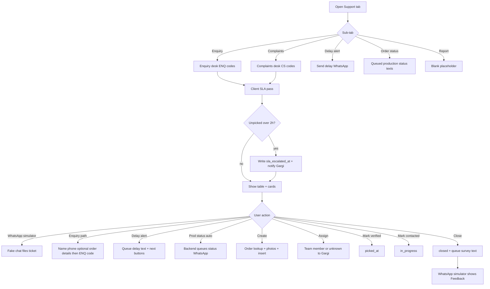
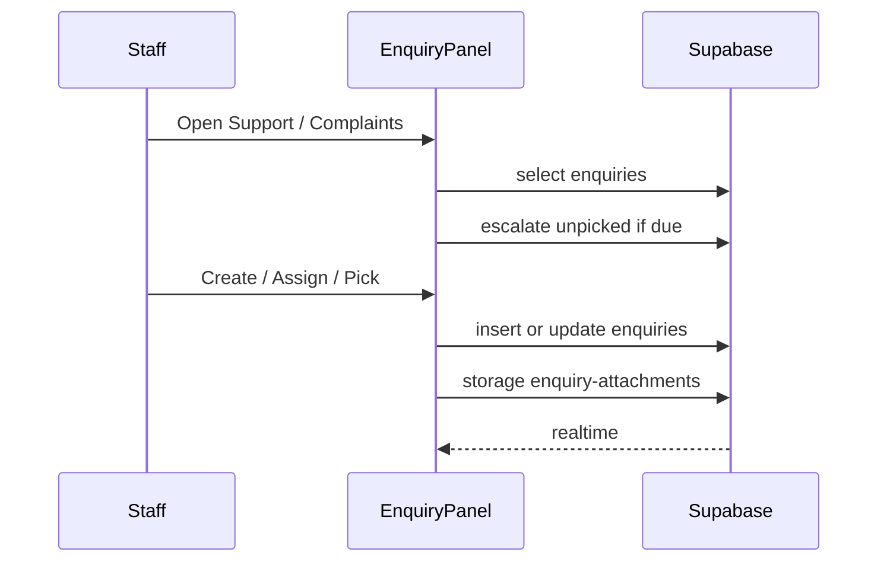
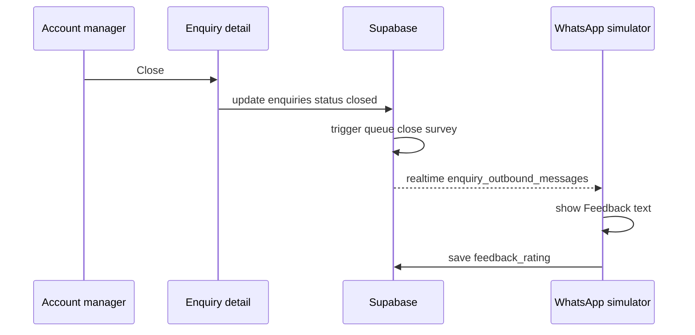
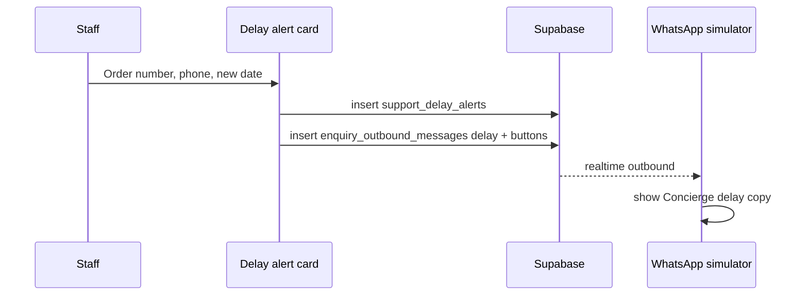
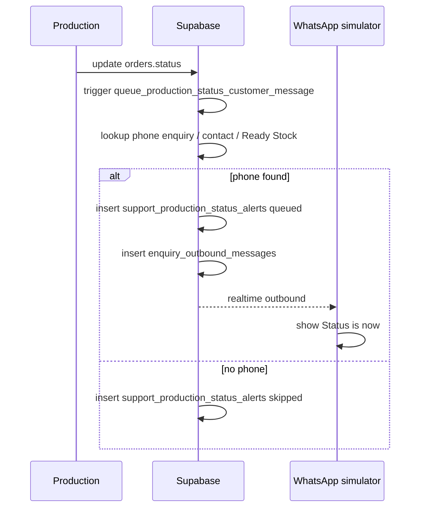
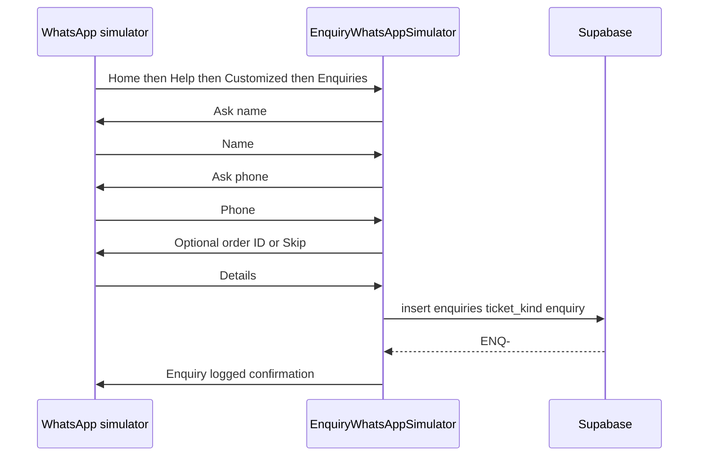
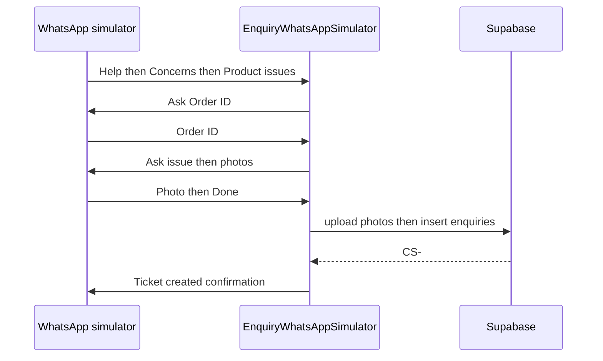
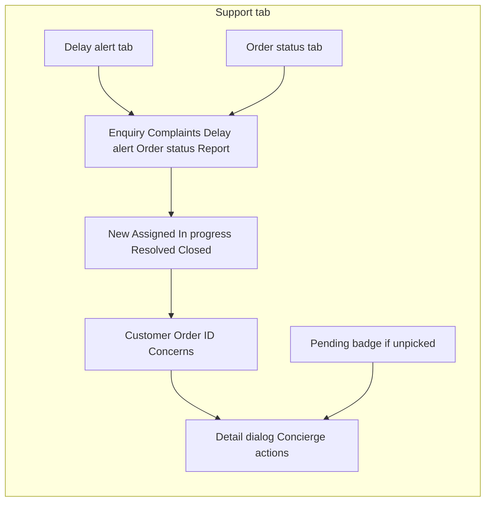
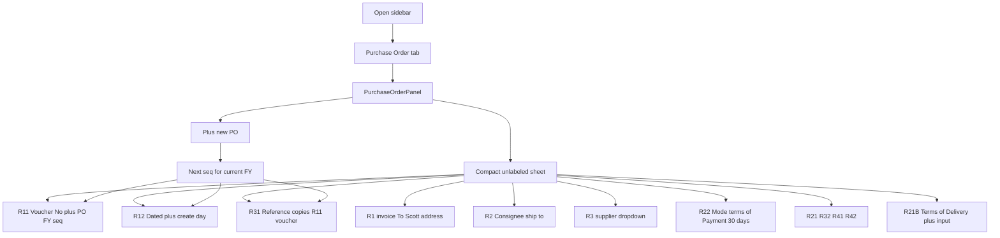
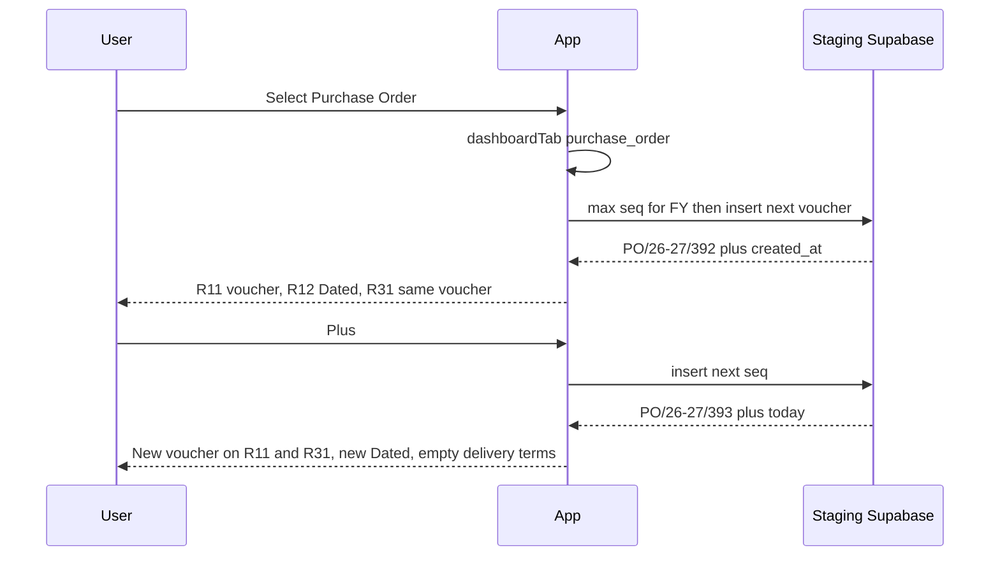

# Flowcharts

## Enquiry Concierge desk (Dashboard Support tab)

Status UI stays **New / Assigned / In progress / Resolved / Closed**. Concierge pick/SLA runs on top.

## Purchase Order main tab

