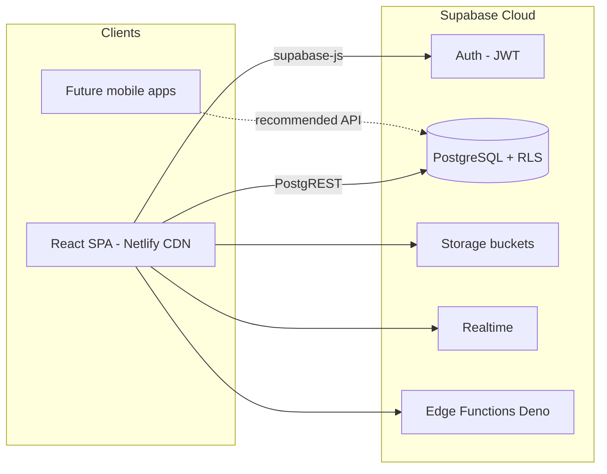

# Scott Dashboard — Product & Platform Overview

## Product overview

**Scott Dashboard** (repo name: `printing-live-tracker`) is an internal **operations and production hub** for Scott's printing and garment workflow. It is **not** an ecommerce storefront. It tracks orders, production job sheets, dispatch, inward/outward logistics, inventory, team collaboration, goals, and admin controls in one web application.

| Item | Detail |
|------|--------|
| **Target users** | Admins, coordinators, production, stores, dispatch, sales |
| **Problem solved** | Replace spreadsheets + fragmented tools with one live system for order → production → dispatch → inventory |
| **Future direction** | Connect mobile apps; gradually replace **Uniware** (WMS/OMS) for warehouse and order orchestration |

---

## Is this Flutter?

**No.** This dashboard is **not built with Flutter**, React Native, or any mobile framework.

| Layer | Technology |
|-------|------------|
| **Frontend** | **React 18** + **Vite 5** (JavaScript/JSX) |
| **UI** | **Tailwind CSS**, **Radix UI** / **shadcn-style** components, **Radix Themes** |
| **Backend** | **Supabase** (managed PostgreSQL + Auth + Storage + Realtime + Edge Functions) |
| **Hosting** | **Netlify** (static SPA from `main` / `develop`) and **Vercel** (Linux `npm install` + Vite build). Do not pin OS-only native packages such as `@rollup/rollup-win32-*` in `dependencies`. |
| **Source control** | **GitHub** — [Mayur8291/Printing-Tracker](https://github.com/Mayur8291/Printing-Tracker) |

The app runs in the **browser** as a Single Page Application (SPA). A future **mobile app** would be a **separate client** talking to the same backend (recommended: via a dedicated API layer — see [PLATFORM_OVERVIEW.md](./PLATFORM_OVERVIEW.md)).

---

## System overview

### Major modules (frontend)

| Module | Location | Purpose |
|--------|----------|---------|
| Core shell & routing | `src/App.jsx` | Tab navigation, auth, orders, admin (~7.6k lines — refactor candidate) |
| Printing / production | `src/App.jsx`, `src/PrintingDepartmentPanel.jsx`, `src/ProductionTrackerPanel.jsx`, `src/LinkedOrdersTabPanel.jsx` | Orders, job sheets, status workflow. Production tracker sidebar has **Production Tracker** / **Sampling Tracker** and **All orders** / **Complete orders** as the same muted pill under each. Lists stay split by kind. Create Sample Jobsheet = Production layout, no Total quantity, IDs `SA-0001`+. Sampling **All orders** **Due In** after Order date = SLA to Dispatched Successfully (`due_date` end of day if filled, else 2 days from save). Sampling Complete has no Due In. Same clock in View Sample Order while open. |
| Dispatch & logistics | `src/DispatchTabPanel.jsx`, inward/outward modals | GRN, challans, verification |
| Inventory | `src/inventory/*` | SKUs, warehouses, POs, suppliers, alerts. List qty = facility availability, not a lone `stock_qty` cell. |
| Ops Platform | `src/MastersPanel.jsx`, `StockLedgerPanel.jsx`, `ProcurementPanel.jsx`, `SalesOrdersPanel.jsx`, `BillingArPanel.jsx`, `UniwareBridgePanel.jsx` | One Source of Truth Steps 0–5 (admin). Uniware Bridge is a read-only ecom mirror — not Inventory on-hand. |
| Team chat | `src/TeamChatPanel.jsx`, `src/teamChatService.js` | DMs, groups, attachments, GIFs |
| Goals & tasks | `src/GoalTrackerPanel.jsx` | Annual goals, assignable tasks |
| Notifications | `src/NotificationsPanel.jsx` | Unified alert feed |
| Internal Support Platform | `src/InternalSupportPlatformPanel.jsx`, `src/internalSupportIssueUtils.js` | Tools tab (`internal_support`, LifeBuoy). **Open Tickets** + **Resolved** (`internal_support_issues`). **Raise an Issue** button opens the form Dialog. Admin sees all rows and can change Status until Resolved. Non-admin sees own issues and read-only status. Separate from Support Enquiry. |
| Support (Enquiry / Complaints / Delay alert / Order status / Report) | `src/EnquiryPanel.jsx`, `src/SupportTicketDesk.jsx`, `src/SupportDelayAlertCard.jsx`, `src/SupportProductionStatusCard.jsx` | Enquiry desk (`ENQ-`) and Complaints desk (`CS-`). Delay alert and production status texts are their own tabs after Complaints. Report blank. |
| Purchase Order | `src/PurchaseOrderPanel.jsx`, `src/PurchaseOrderLayoutGrid.jsx`, `src/PurchaseOrderHistoryTable.jsx`, `src/PurchaseOrderHistoryFilters.jsx`, `src/purchaseOrderLayout.js`, `src/purchaseOrderVoucherUtils.js`, `src/purchaseOrderHistoryUtils.js` | Main sidebar tab after Inventory. Heading left, separate tabs **All PO Orders** / **Create new PO** / **PO History**. Open panel = All PO Orders (Pending, PO sent, PO Approved; admin can change those plus Completed). Create = A4 heading + table after click. Generate writes `po_sent`. History = Completed only after backend update; no status pick. Filters + View PO print. Spreadsheet icon. Not Inventory POs. |
| Admin | User mgmt, deploy, roles | Edge Functions for privileged actions |

### Data flow (typical)

1. User logs in → Supabase Auth issues JWT.
2. React app loads profile + permissions from `profiles` / `profile_order_permissions`.
3. UI reads/writes tables via `@supabase/supabase-js` (PostgREST).
4. **Row Level Security (RLS)** on PostgreSQL enforces who can see/edit what.
5. File uploads go to **Supabase Storage** (designs, invoices, avatars, chat files).
6. **Realtime** subscriptions push chat messages, notifications, permission changes.

---

## Technology stack (detail)

### Frontend

- **Build tool:** Vite (`vite.config.js`) — fast dev server, production bundle to `dist/`
- **Language:** JavaScript (JSX), ES modules
- **State:** React `useState` / `useEffect` / context (e.g. `InventoryDataContext`) — no Redux
- **Charts:** Recharts
- **Excel/export:** ExcelJS, JSZip
- **Barcodes/QR:** jsbarcode, qrcode
- **Env vars:** `VITE_*` injected at build time (Netlify env for production)

### Backend (Supabase)

- **Database:** PostgreSQL with **103+ migrations** in `supabase/migrations/`
- **Auth:** Email/password; roles `admin` | `viewer` on `profiles`
- **API surface today:** Auto-generated **PostgREST** REST API + RPC functions in SQL
- **Edge Functions** (Deno/TypeScript): `admin-create-user`, `admin-delete-user`, `admin-reset-password`, `admin-promote-production`, `tenor-gif-search`, `uniware-bridge`
- **Storage buckets:** e.g. approved designs, profile avatars, notification tones, chat attachments, contact photos

### Infrastructure

| Environment | Git branch | Frontend | Database |
|-------------|------------|----------|----------|
| Production | `main` | Netlify production | Supabase prod (`levwrmvqdntngeasrtnb`) |
| Staging | `develop` | Netlify branch deploy | Separate Supabase staging project |
| Local dev | any | `npm run dev` :5173 | Staging Supabase via `.env.development` |

See [ENVIRONMENTS.md](./ENVIRONMENTS.md) and [RELEASE_AUTOMATION.md](./RELEASE_AUTOMATION.md).

---

## Repository structure

| Path | Purpose |
|------|---------|
| `src/` | React application source |
| `src/components/` | Reusable UI (shadcn-style, layout, chat, profile) |
| `src/inventory/` | Inventory submodule (pages, modals, utils) |
| `public/` | Static assets (icons, sounds, avatar presets, mockups) |
| `supabase/schema.sql` | Baseline schema reference |
| `supabase/migrations/` | Incremental DB changes |
| `supabase/functions/` | Edge Functions |
| `docs/` | Project documentation |
| `netlify.toml` | Build & deploy config |
| `.github/workflows/` | CI — promote to production |

---

## Related documents

| Document | Contents |
|----------|----------|
| [PLATFORM_OVERVIEW.md](./PLATFORM_OVERVIEW.md) | **Full platform brief** — API strategy, mobile, Uniware replacement, scaling, improvements |
| [ARCHITECTURE.md](./ARCHITECTURE.md) | Architecture boundaries and communication patterns |
| [DATABASE.md](./DATABASE.md) | Tables, migrations, RPCs |
| [FLOWS.md](./FLOWS.md) | User flows |
| [ENVIRONMENTS.md](./ENVIRONMENTS.md) | Staging vs production |
| [RELEASE_AUTOMATION.md](./RELEASE_AUTOMATION.md) | Deploy pipeline |
| [DEBUGGING.md](./DEBUGGING.md) | Common failures |
| [SECURITY.md](./SECURITY.md) | Auth, secrets, API keys |
| [VULNERABILITIES.md](./VULNERABILITIES.md) | Whole-build vulnerability audit (2026-08-17) |
| [ONE_SOURCE_OF_TRUTH_ROADMAP.md](./ONE_SOURCE_OF_TRUTH_ROADMAP.md) | Scott Ops Platform build roadmap (Steps 0–10) |
| [UNIWARE_BOUNDARY.md](./UNIWARE_BOUNDARY.md) | Step 5 ownership: Uniware owns ecom stock; platform mirrors only |
| [laws.md](./laws.md) | Nine binding laws + six-question gate + Scott API freeze |

For a **Word-friendly export**, open `docs/export/Scott_Dashboard_Platform_Overview.html` in Microsoft Word → **Save As → .docx**.
