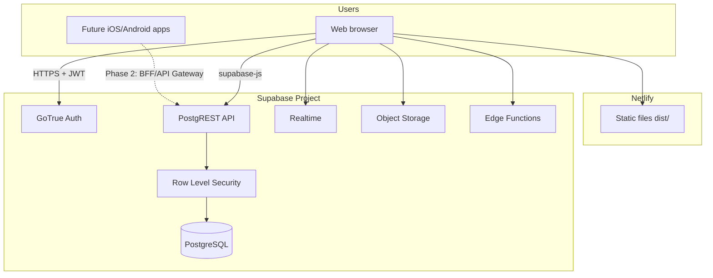

# Scott Dashboard — Platform Overview, API Strategy & Roadmap

**Document version:** 2026-07-08  
**Audience:** Founders, engineering, operations, mobile team  
**Repository:** [Mayur8291/Printing-Tracker](https://github.com/Mayur8291/Printing-Tracker)

---

## 1. Executive summary

Scott Dashboard is a **web-based operations platform** built with **React + Vite** on the frontend and **Supabase** (PostgreSQL, Auth, Storage, Realtime, Edge Functions) on the backend. It is hosted as a static site on **Netlify**.

It is **not Flutter**, **not Next.js**, and **not a traditional self-hosted Node/Java API monolith**. The browser app talks **directly to Supabase** using the official JavaScript client (`@supabase/supabase-js`), with security enforced primarily through **PostgreSQL Row Level Security (RLS)**.

This architecture is excellent for **rapid internal tool delivery** and **real-time collaboration**. For **large-scale mobile + Uniware replacement**, you should plan a phased evolution toward a **dedicated API layer**, clearer domain boundaries, and stronger automated testing — detailed in Sections 8–11.

---

## 2. What we are using (complete stack)

### 2.1 Frontend

| Component | Choice | Notes |
|-----------|--------|-------|
| Framework | **React 18** | Component-based UI |
| Build | **Vite 5** | `npm run dev`, `npm run build` → `dist/` |
| Language | **JavaScript (JSX)** | No TypeScript in main app today |
| Styling | **Tailwind CSS 3** + custom CSS | `src/styles.css`, `src/inventory/inventory.css` |
| Components | **Radix UI** primitives | Dialog, Select, Sidebar, etc. |
| Design system | **shadcn-style** (`src/components/ui/`) | Button, Card, Avatar, etc. |
| Icons | **Lucide React** | |
| Charts | **Recharts** | Coordinator / product reports |
| Client DB SDK | **@supabase/supabase-js** | All CRUD + auth + storage + realtime |

**Entry point:** `src/main.jsx` → `src/App.jsx` (main application shell and most business tabs).

### 2.2 Backend

| Component | Choice | Notes |
|-----------|--------|-------|
| Database | **PostgreSQL** (Supabase-managed) | Single source of truth |
| Auth | **Supabase Auth** | Email/password; JWT in browser |
| REST API | **PostgREST** (auto from schema) | Tables/views exposed as REST |
| Business RPCs | **PostgreSQL functions** | e.g. chat conversation helpers, goal assignment |
| Privileged ops | **Supabase Edge Functions** (Deno) | Admin user create/delete, production promote |
| Files | **Supabase Storage** | Designs, invoices, avatars, chat media |
| Realtime | **Supabase Realtime** | Chat, notifications, live permission updates |
| Migrations | **Supabase CLI** | `supabase/migrations/*.sql` (100+ files) |

There is **no separate Express/FastAPI/Spring server** in this repo today.

### 2.3 DevOps & hosting

| Component | Choice |
|-----------|--------|
| Frontend hosting | **Netlify** (CDN + CI from GitHub) |
| Backend hosting | **Supabase Cloud** (managed) |
| CI/CD | GitHub Actions (`promote-to-production.yml`) + Netlify auto-build on push |
| Branches | `develop` → staging, `main` → production |
| Node version | 20+ (`netlify.toml`, `package.json`) |

### 2.4 Third-party integrations (current)

| Integration | Purpose |
|-------------|---------|
| **Giphy API** | Chat GIF search (`VITE_GIPHY_API_KEY`) |
| **GitHub** | Release automation (merge develop → main) |
| **Supabase MCP** | Dev/agent database access (staging vs prod) |

**Uniware:** Not integrated today. Inventory, dispatch, and orders are modeled in-house — Uniware replacement is a **future program** (Section 10).

---

## 3. Architecture today

### 3.1 High-level diagram



### 3.2 Security model

1. **Authentication:** Supabase Auth → JWT stored in browser.
2. **Authorization:** PostgreSQL **RLS policies** per table; helpers like `jwt_user_is_admin()`, `jwt_viewer_can_create_orders()`.
3. **Field-level UI permissions:** `profile_order_permissions` — which order fields and sidebar tabs each viewer can see/edit.
4. **Admin-only actions:** Edge Functions with service role (create user, reset password, promote production).
5. **Secrets:** `VITE_SUPABASE_ANON_KEY` is public in the browser (by design); **never** embed service role key in frontend.

### 3.3 How the web app accesses data (no custom REST server)

```text
React component
  → supabase.from('orders').select(...)
  → HTTPS to https://<project>.supabase.co/rest/v1/orders
  → PostgREST
  → RLS check with JWT
  → PostgreSQL
```

RPC example: `supabase.rpc('get_or_create_direct_conversation', { ... })`.

---

## 4. Domain modules & database (functional map)

### 4.1 Core operational domains

| Domain | Key tables / assets | UI entry |
|--------|---------------------|----------|
| **Printing orders** | `orders`, `order_activity_log`, `order_templates` | Printing Orders tab |
| **Production / job sheets** | `orders` (`is_production_order`, job_sheet_* columns) | Production tracker |
| **Dispatch** | Dispatch fields on `orders`, verification flags | Dispatch tab |
| **Inward / GRN** | `inward_grn_entries`, tags, notifications | Dispatch → Inward |
| **Outward challans** | Outward challan tables (migrations) | Dispatch → Outward |
| **Billing** | Invoice URLs on orders | Billing tab |
| **Inventory** | SKUs, warehouses, suppliers, POs, stock (inventory migrations) | Inventory tab |
| **Printing dept stock** | Printing department inventory tables | Printing department |
| **Team chat** | `team_chat_conversations`, messages, members | Chat tab |
| **Goals & tasks** | `user_annual_goals`, `user_goal_tasks` | Goals tab |
| **Notifications** | Assignment, status, goal, inward, inventory notification tables | Bell + Notifications tab |
| **Contacts** | `contact_book_entries` | Contact Book |
| **Shared links** | `shared_resource_links` | Shared Links |
| **Users & permissions** | `profiles`, `profile_order_permissions` | Admin |
| **Dealer / distributor** | Dealer report tables | Distributor tab |

See [DATABASE.md](./DATABASE.md) for migration-level detail.

### 4.2 Edge Functions (privileged backend code)

| Function | Purpose |
|----------|---------|
| `admin-create-user` | Create auth user + profile + permissions |
| `admin-delete-user` | Remove user |
| `admin-reset-password` | Admin password reset |
| `admin-promote-production` | Trigger GitHub release workflow |
| `tenor-gif-search` | Legacy GIF proxy (Giphy now client-side) |

---

## 5. Deployment & environments

| Stage | Trigger | Frontend | Database |
|-------|---------|----------|----------|
| **Local** | `npm run dev` | localhost:5173 | Staging Supabase (`.env.development`) |
| **Staging** | Push to `develop` | Netlify branch URL | Staging Supabase project |
| **Production** | Push to `main` or Release button | Netlify production URL | Production Supabase |

**Build command:** `npm ci && npm run build`  
**Publish directory:** `dist/`  
**Required Netlify env:** `VITE_SUPABASE_URL`, `VITE_SUPABASE_ANON_KEY`, optional `VITE_GIPHY_API_KEY`

Full guide: [ENVIRONMENTS.md](./ENVIRONMENTS.md), [RELEASE_AUTOMATION.md](./RELEASE_AUTOMATION.md), [DEBUGGING.md](./DEBUGGING.md).

---

## 6. Current strengths

1. **Fast iteration** — schema migration + React deploy in hours, not weeks.
2. **Real-time** — chat and notifications without custom WebSocket servers.
3. **Unified ops view** — orders, production, dispatch, inventory, chat in one place.
4. **Fine-grained viewer permissions** — sidebar tabs and order field ACLs.
5. **Staging/production split** — safe QA before live release.
6. **Cost-effective scale** for current user count — Supabase + Netlify pay-as-you-grow.

---

## 7. Current limitations & technical debt (honest assessment)

| Area | Issue | Risk | Priority |
|------|-------|------|----------|
| **Monolithic App.jsx** | ~7,600 lines; most tabs wired here | Hard to maintain, test, onboard devs | **High** |
| **No TypeScript** | JS only | Runtime errors, weak contracts for mobile/API | Medium |
| **No automated tests** | No Jest/Playwright suite visible | Regressions on release | **High** |
| **Business logic in UI** | Validation/rules spread in components | Duplication when mobile arrives | **High** |
| **Direct PostgREST from browser** | Mobile would need same RLS surface or duplicate logic | Security review burden; API versioning hard | **High** for mobile |
| **Large JS bundle** | Vite warns chunks > 500 KB | Slow first load on poor networks | Medium |
| **RLS complexity** | Many policies; history of recursion fixes | Subtle permission bugs | Medium |
| **Migration history** | Remote sync placeholders, out-of-order repairs | Prod push friction | Medium |
| **No formal API docs** | PostgREST is implicit | Mobile/third-party integration slow | **High** |
| **Single-region Supabase** | Default one region | Latency if users spread nationally | Low until scale |
| **Uniware gap** | No channel sync, marketplace, advanced WMS | Cannot replace Uniware yet | Expected — roadmap |

These are **normal for a successful internal MVP** that grew into a platform. They are **fixable with planned architecture work**, not a rewrite.

---

## 8. Recommended API strategy (for mobile & scale)

### 8.1 Phase 1 — Document & stabilize (now – 3 months)

1. **Publish API catalog** — document every table/RPC mobile needs ([API.md](./API.md) to maintain).
2. **Extract domain services** from `App.jsx` into modules (`src/services/orders.js`, etc.).
3. **Add integration tests** for critical RPCs and RLS (Supabase local + pgTAP or API tests).
4. **Introduce TypeScript gradually** — start with `supabase/` types generated from schema.

### 8.2 Phase 2 — Backend-for-Frontend (BFF) API (3–9 months)

Add a **thin API layer** mobile and partners call instead of raw PostgREST:

| Option | Pros | Cons |
|--------|------|------|
| **Supabase Edge Functions** (extend current) | Same stack, JWT reuse | Cold starts, Deno limits for heavy jobs |
| **Node/Fastify or NestJS on Railway/Fly.io** | Full control, OpenAPI, webhooks | New service to operate |
| **Cloudflare Workers + Hono** | Edge, cheap scale | Learning curve |

**Recommended pattern:**

```text
Mobile app → API Gateway (REST or GraphQL)
           → Validates JWT (Supabase)
           → Service layer (business rules)
           → Supabase service role OR direct PG pool (careful)
           → PostgreSQL
```

**Expose versioned endpoints**, e.g.:

- `POST /v1/orders` — create order with server-side validation  
- `GET /v1/orders/:id/status` — mobile-friendly DTO  
- `POST /v1/inventory/adjustments` — stock movement with audit  
- `POST /v1/webhooks/uniware` — future inbound sync  

Use **OpenAPI 3** spec as contract between mobile and backend teams.

### 8.3 Phase 3 — Event-driven scale (9–18 months)

For high volume and Uniware sync:

- **Outbox pattern** — DB triggers → queue (Supabase pg_net, or external Redis/SQS).
- **Workers** — process inventory sync, label printing, marketplace orders.
- **Read replicas** — Supabase Pro/Team for reporting without loading primary.
- **CDN + edge** — Netlify already covers frontend; add rate limiting on API gateway.

---

## 9. Mobile app integration plan

### 9.1 Principles

1. **Reuse Supabase Auth** — same users; mobile uses `signInWithPassword` + refresh tokens.
2. **Do not ship service role key in mobile** — only anon key + user JWT.
3. **Prefer BFF** over exposing 50+ PostgREST tables to mobile.
4. **Optimistic UI + offline queue** for warehouse scanning (outward/inward barcodes).

### 9.2 Suggested mobile scope (MVP)

| Feature | Dashboard today | Mobile MVP |
|---------|-----------------|------------|
| Login | Web | Shared Supabase Auth |
| Order status lookup | Full order UI | Scan/search order ID |
| Dispatch verify | Dispatch tab | Pass/fail + photo |
| Inward GRN | Inward forms | Camera + size entry |
| Outward challan | Challan list | Barcode scan confirm |
| Notifications | Bell + realtime | Push (FCM/APNs via Edge Function) |
| Chat | Full chat | Phase 2 |
| Inventory | Full module | Stock lookup / adjust Phase 2 |

### 9.3 Mobile tech choice (separate from dashboard)

| Option | When to use |
|--------|-------------|
| **Flutter** | If team wants one codebase for iOS+Android + rich offline UI |
| **React Native** | If team already knows React (closer to dashboard skills) |
| **Native Swift/Kotlin** | Maximum performance for scanner-heavy warehouse apps |

The **dashboard stays React web**; mobile is a **new repo** consuming the same backend/API.

---

## 10. Uniware replacement — gap analysis & roadmap

**Uniware** (Unicommerce) is typically used for: omnichannel order management, inventory across locations, pick/pack/ship, marketplace integrations (Amazon/Flipkart/etc.), shipping label generation, and WMS workflows.

### 10.1 What Scott Dashboard already covers (partial Uniware overlap)

| Uniware capability | Scott Dashboard status |
|--------------------|------------------------|
| Internal order tracking | ✅ Strong — printing + job sheets |
| Production stages | ✅ Status workflow + job sheet stages |
| Dispatch verification | ✅ Dispatch tab |
| Inward / GRN | ✅ Inward entries |
| Outward / challans | ✅ Outward module |
| Warehouse inventory | ✅ Growing — inventory module, printing dept stock |
| Multi-warehouse logic | ⚠️ Partial — warehouses in inventory schema |
| Channel / marketplace orders | ❌ Not built |
| Courier integration / AWB | ❌ Not built |
| Uniware API sync | ❌ Not built |
| Returns / RTO | ❌ Not built |
| Advanced pick paths / bin locations | ❌ Not built |

### 10.2 Suggested replacement phases

**Phase A — Source of truth internally (current → 6 mo)**  
- Harden inventory (SKU, stock ledger, PO GRN → stock increase).  
- Tie `orders` dispatch status to stock deduction events.  
- Audit log for every stock movement.

**Phase B — Integration hub (6–12 mo)**  
- Build `integration_events` table + webhook/API endpoints.  
- Optional: read-only sync **from** Uniware while you migrate (orders in, ship status out).  
- Nightly reconciliation job.

**Phase C — Channel ingestion (12–18 mo)**  
- Marketplace connectors or middleware (e.g. custom + EasyEcom alternative patterns).  
- Normalize external orders → internal `orders` + inventory reservations.

**Phase D — Decommission Uniware (18+ mo)**  
- All channels flow through Scott platform API.  
- WMS mobile app for floor operations.  
- Reporting parity with Uniware exports.

**Do not big-bang cutover.** Run **parallel operations** with reconciliation until inventory accuracy ≥ 99.5% for 90 days.

---

## 11. Large-scale hosting recommendations

### 11.1 Current stack limits (approximate)

| Tier | Users | Orders/day | Notes |
|------|-------|------------|-------|
| Supabase Free/Pro | tens–low hundreds concurrent | thousands | Fine for current internal use |
| Netlify | unlimited static views | N/A | Bandwidth on Pro if global |

### 11.2 When you outgrow default setup

1. **Supabase** — upgrade to Pro/Team; enable connection pooling (PgBouncer); consider read replica for reports.  
2. **Netlify** — Pro for team seats, build minutes, env secrets.  
3. **API layer** — horizontal scale on Fly.io/Railway/AWS ECS behind load balancer.  
4. **Background jobs** — separate worker service (not in Vite SPA).  
5. **Observability** — Sentry (frontend + API), Supabase logs, uptime checks.  
6. **Backups** — Supabase PITR; test restore quarterly.  
7. **Security** — WAF on API gateway; rate limits; audit admin Edge Functions.

### 11.3 Multi-region (if needed later)

- Supabase: choose primary region closest to ops (e.g. Mumbai/Singapore).  
- Netlify: global CDN already.  
- API: deploy workers in same region as DB to minimize latency.

---

## 12. Improvement backlog (prioritized)

### Quick wins (1–4 weeks)

- [ ] Split `App.jsx` into route-level panels (already partially separate files — finish extraction).  
- [ ] Code-split heavy tabs (Inventory, Admin) via `React.lazy`.  
- [ ] Generate TypeScript types from Supabase schema.  
- [ ] Add smoke test script (`npm run check:ui` exists — extend).  
- [ ] Complete [API.md](./API.md) with all RPCs and mobile-critical tables.

### Medium term (1–3 months)

- [ ] Introduce BFF with OpenAPI for mobile team.  
- [ ] Centralize validation (Zod schemas shared web/API).  
- [ ] Push notifications via Edge Function + FCM.  
- [ ] Stock ledger table with immutable movement rows.  
- [ ] Admin audit log for permission and inventory changes.

### Long term (3–12 months)

- [ ] Uniware sync adapter (read-only → two-way).  
- [ ] Mobile warehouse app (RN or Flutter).  
- [ ] Marketplace order normalization layer.  
- [ ] Optional: migrate hottest read paths to materialized views / caching.

---

## 13. Glossary

| Term | Meaning |
|------|---------|
| **SPA** | Single Page Application — loads once, tabs swap in browser |
| **RLS** | Row Level Security — Postgres policies per user |
| **PostgREST** | Auto REST API from PostgreSQL schema |
| **BFF** | Backend-for-Frontend — API tailored for clients |
| **WMS** | Warehouse Management System |
| **OMS** | Order Management System |
| **Uniware** | Unicommerce warehouse/omnichannel platform you plan to replace |

---

## 14. Document maintenance

When architecture changes, update this file plus [OVERVIEW.md](./OVERVIEW.md), [ARCHITECTURE.md](./ARCHITECTURE.md), [API.md](./API.md), [DATABASE.md](./DATABASE.md), and [CHANGELOG.md](./CHANGELOG.md).

**Export to Word:** Open `docs/export/Scott_Dashboard_Platform_Overview.html` in Microsoft Word → Save As `.docx`.
